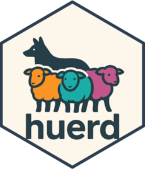

<!-- README.md is generated from README.Rmd. Please edit that file -->

```{r, include = FALSE}
knitr::opts_chunk$set(
  collapse = TRUE,
  comment = "#>",
  fig.path = "man/figures/README-",
  out.width = "100%",
  dpi = 150,
  fig.width = 8,
  fig.height = 5,
  dev = "png"
)
```

# huerd <a href="https://sims1253.github.io/huerd/"></a>

<!-- badges: start -->
[](LICENSE)
[](https://github.com/sims1253/huerd/actions/workflows/R-CMD-check.yaml)
[](https://github.com/sims1253/huerd/actions/workflows/test-coverage.yaml)
[](https://app.codecov.io/gh/sims1253/huerd)
[](https://github.com/sims1253/huerd/actions/workflows/pkgdown.yaml)
[](https://lifecycle.r-lib.org/articles/stages.html#experimental)
<!-- badges: end -->

A discrete color palette generator with support for fixed colors, optimized for color vision deficient viewers. It includes several optimization algorithms and a multi-objective framework for advanced palette generation.

## Installation

You can install the development version of huerd from GitHub with:

``` r
# install.packages("pak")
pak::pak("sims1253/huerd")
```

## Basic Usage

Generate a palette with 8 colors using the standard or quick method:

```{r example}
library(huerd)

set.seed(42)
# Standard generation with full control
palette <- generate_palette(8, progress = FALSE)
print(palette)

# Quick generation for immediate use
quick_palette <- quick_palette(8)
print(quick_palette)
```

Visualize your palette:

```{r visualize}
library(huerd)

set.seed(42)
palette <- generate_palette(8, progress = FALSE)
plot(palette, type = "swatches")
```

## ggplot2 Integration

Use huerd palettes directly in your ggplot2 visualizations:

```{r ggplot}
library(ggplot2)
library(huerd)

# Create a huerd palette
set.seed(42)
huerd_colors <- generate_palette(5, progress = FALSE)

# Example with iris data using scale_color_huerd()
ggplot(iris, aes(x = Sepal.Length, y = Sepal.Width, color = Species)) +
  geom_point(size = 3) +
  scale_color_huerd(palette = huerd_colors) +
  theme_minimal() +
  labs(title = "Iris Dataset with huerd Colors")

# Example with mtcars data using scale_fill_huerd()
ggplot(mtcars, aes(x = factor(cyl), fill = factor(cyl))) +
  geom_bar() +
  scale_fill_huerd(palette = huerd_colors) +
  theme_minimal() +
  labs(title = "Car Cylinder Count with huerd Colors",
       x = "Number of Cylinders", y = "Count")
```

## Convenience Functions

Access pre-made palettes and export options for different workflows:

```{r convenience}
library(huerd)

# Get a quick palette without generation
quick_colors <- quick_palette(6)
print(quick_colors)

# Access the default brand palette
brand_colors <- brand_palette(c("#003366", "#FF6600"), n_total = 6)
print(brand_colors)

# Export palette in different formats for web development
color_names <- paste0("color_", seq_along(quick_colors))
css_output <- export_palette(quick_colors, format = "css", names = color_names)
cat("CSS Output:\n", css_output, "\n\n")

sass_output <- export_palette(quick_colors, format = "sass", names = color_names)
cat("Sass Output:\n", sass_output, "\n\n")

json_output <- export_palette(quick_colors, format = "json", names = color_names)
cat("JSON Output:\n", json_output, "\n")

# Interpret palette quality metrics
quality_info <- interpret_palette_quality(quick_colors)
print(quality_info)
```

## Constrained Color Palettes

Include specific colors while optimizing the remaining colors:

```{r constrained}
library(huerd)

set.seed(123)
palette <- generate_palette(
  n = 8,
  include_colors = c("#4A6B8A", "#E5A04C"),
  progress = FALSE
)
print(palette)

```

## Multi-Optimizer Support

Choose from 4 optimization algorithms (a fifth, `"nlopt_direct"`,
is deprecated and will be removed):

```{r optimizers}
library(huerd)

set.seed(456)
# COBYLA: Default deterministic optimizer for general use
cobyla_palette <- generate_palette(6, optimizer = "nloptr_cobyla", progress = FALSE)

# SANN: Stochastic simulated annealing for higher quality
sann_palette <- generate_palette(6, optimizer = "sann", progress = FALSE)

# Nelder-Mead: Derivative-free local optimization
# As an alternative deterministic approach
neldermead_palette <- generate_palette(6, optimizer = "nlopt_neldermead", progress = FALSE)

# L-BFGS: Gradient-based optimization for smooth objectives (v0.5.0+)
lbfgs_palette <- generate_palette(6, optimizer = "nlopt_lbfgs",
                                  weights = c(smooth_repulsion = 1), progress = FALSE)

cat("COBYLA:", paste(cobyla_palette, collapse = ", "), "\n")
cat("SANN:", paste(sann_palette, collapse = ", "), "\n")
cat("Nelder-Mead:", paste(neldermead_palette, collapse = ", "), "\n")
cat("L-BFGS:", paste(lbfgs_palette, collapse = ", "), "\n")
```

## Multi-Objective Framework

The package includes a multi-objective framework that supports both discrete and smooth optimization:

```{r multiobjective}
library(huerd)

set.seed(789)
# Discrete distance optimization (default)
distance_palette <- generate_palette(
  n = 6,
  weights = c(distance = 1),  # Explicit distance weighting
  optimizer = "nloptr_cobyla",
  progress = FALSE
)

# Smooth optimization for faster convergence (v0.5.0+)
smooth_palette <- generate_palette(
  n = 8,
  weights = c(smooth_repulsion = 1),  # Smooth repulsion objective
  optimizer = "nlopt_lbfgs",          # L-BFGS for gradient-based optimization
  progress = FALSE
)

# Alternative smooth objective using log-sum-exp
logsumexp_palette <- generate_palette(
  n = 6,
  weights = c(smooth_logsumexp = 1),
  optimizer = "nlopt_lbfgs",
  progress = FALSE
)

# Compare optimization results
cat("Distance-based palette:\n")
print(distance_palette)
cat("\nSmooth repulsion palette:\n")
print(smooth_palette)
cat("\nLog-sum-exp palette:\n")
print(logsumexp_palette)
```

## Diagnostic Dashboard

Get a quick overview of your palette properties:

```{r dashboard}
library(huerd)

set.seed(2024)
palette <- generate_palette(8, progress = FALSE)
plot_palette_analysis(palette, force_font_scale = 0.6)
```

## Palette Quality Evaluation

Or look at the numerical evaluation results:

```{r evaluation}
library(huerd)

set.seed(314)
palette <- generate_palette(8, progress = FALSE)
evaluation <- evaluate_palette(palette)

# Access raw metrics (no subjective scoring)
cat("Minimum distance:", evaluation$distances$min, "\n")
cat("Performance ratio:", evaluation$distances$performance_ratio * 100, "%\n")
cat("CVD worst case:", evaluation$cvd_safety$worst_case_min_distance, "\n")
```

## Custom Parameters

Fine-tune the generation process with advanced options:

```{r custom}
library(huerd)

set.seed(271)
palette <- generate_palette(
  n = 8,
  initialization = "harmony",              # Color harmony-based initialization
  init_lightness_bounds = c(0.3, 0.8),    # Constrain lightness range
  max_iterations = 2000,                   # Increased iterations
  optimizer = "nloptr_cobyla",             # Use COBYLA for optimization
  progress = FALSE
)
print(palette)
```

## Complete Workflow Example

```{r workflow}
library(huerd)

set.seed(161)
# 1. Generate brand palette with advanced optimization
my_brand_palette <- generate_palette(
  n = 8,
  include_colors = c("#1f77b4", "#ff7f0e"),  # Fixed brand colors
  fixed_aesthetic_influence = 0.9,
  initialization = "harmony",
  optimizer = "sann",
  max_iterations = 5000,
  weights = c(distance = 1),
  return_metrics = TRUE,
  progress = TRUE
)

# 2. Diagnostic analysis
plot_palette_analysis(my_brand_palette, force_font_scale = 0.6)

# 3. Quality evaluation
evaluation <- evaluate_palette(my_brand_palette)
cat("Min distance:", round(evaluation$distances$min, 3), "\n")
cat("Performance:", round(evaluation$distances$performance_ratio * 100, 1), "%\n")

# 4. CVD accessibility check
cvd_safe <- is_cvd_safe(my_brand_palette)
if (cvd_safe) {
  cat("Palette is CVD-accessible\n")
} else {
  cat("Palette may challenge CVD viewers\n")
}

# 5. CVD simulation for verification
cvd_simulation <- simulate_palette_cvd(my_brand_palette, cvd_type = "all")
print(cvd_simulation)

# 6. Display final palette (colors are brightness-sorted)
print(my_brand_palette)
```

## Workflow Guides

The huerd package includes vignettes for different user needs:

- **[Data Scientist Workflow](https://sims1253.github.io/huerd/articles/data-scientist-workflow.html)**: Create accessible dashboard visualizations with optimized color schemes for color vision deficient viewers.

- **[Designer Workflow](https://sims1253.github.io/huerd/articles/designer-workflow.html)**: Integrate brand colors into cohesive palettes and export them in CSS, Sass, or JSON for web development.

- **[Package Developer Workflow](https://sims1253.github.io/huerd/articles/package-developer-workflow.html)**: Use the programmatic API for reproducible palette generation and integrate huerd into your own packages or applications.
