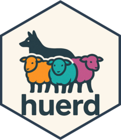
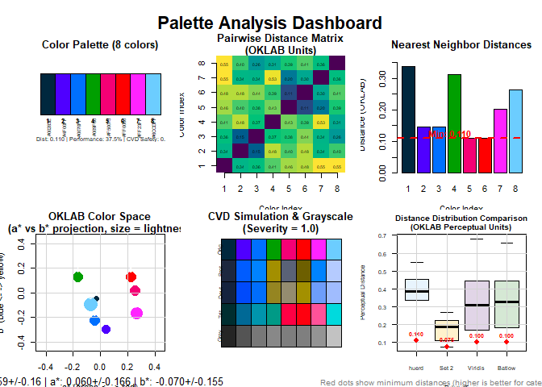
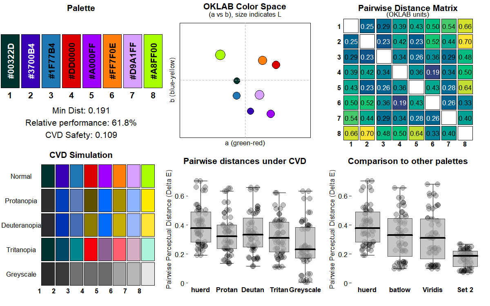

<!-- README.md is generated from README.Rmd. Please edit that file -->

# huerd <a href="https://sims1253.github.io/huerd/"></a>

<!-- badges: start -->

[](LICENSE)
[](https://github.com/sims1253/huerd/actions/workflows/R-CMD-check.yaml)
[](https://github.com/sims1253/huerd/actions/workflows/test-coverage.yaml)
[](https://app.codecov.io/gh/sims1253/huerd)
[](https://github.com/sims1253/huerd/actions/workflows/pkgdown.yaml)
<!-- badges: end -->

A discrete color palette generator with support for fixed colors
optimized for both normal and color vision deficient viewers.

## Installation

You can install the development version of huerd from
[GitHub](https://github.com/) with:

``` r
# install.packages("pak")
pak::pak("sims1253/huerd")
```

## Basic Example

Generate a palette with 5 colors:

``` r
library(huerd)

palette <- generate_palette(8)
print(palette)
#> 
#> -- huerd Color Palette (8 colors) --
#> Colors:
#> [ 1] #002300
#> [ 2] #420200
#> [ 3] #340083
#> [ 4] #764C4F
#> [ 5] #005FFF
#> [ 6] #FF5000
#> [ 7] #FF00FF
#> [ 8] #00E100
#> 
#> -- Quality Metrics Summary --
#> * Min. Perceptual Distance (OKLAB): 0.143
#> * Optimizer Performance Ratio      : 48.9%
#> * Min. CVD-Safe Distance (OKLAB)  : 0.017
#> 
#> -- Generation Details --
#> * Optimizer Iterations: 717
#> * Optimizer Status: NLOPT_XTOL_REACHED: Optimization stopped because xtol_rel or xtol_abs (above) was reached.
```

## Constrained Color Palettes

Include specific colors while optimizing the remaining colors:

``` r
library(huerd)

palette <- generate_palette(
  n = 8,
  include_colors = c("#4A6B8A", "#E5A04C")
)
print(palette)
#> 
#> -- huerd Color Palette (8 colors) --
#> Colors:
#> [ 1] #001700
#> [ 2] #6D0020
#> [ 3] #3A00A8
#> [ 4] #4A6B8A
#> [ 5] #005CFF
#> [ 6] #CA5B00
#> [ 7] #E5A04C
#> [ 8] #83BEFF
#> 
#> -- Quality Metrics Summary --
#> * Min. Perceptual Distance (OKLAB): 0.168
#> * Optimizer Performance Ratio      : 57.4%
#> * Min. CVD-Safe Distance (OKLAB)  : 0.084
#> 
#> -- Generation Details --
#> * Optimizer Iterations: 270
#> * Optimizer Status: NLOPT_XTOL_REACHED: Optimization stopped because xtol_rel or xtol_abs (above) was reached.
```

## Diagnostic Dashboard

Analyze palette quality with a dashboard:

``` r
library(huerd)

palette <- generate_palette(8)
plot_palette_analysis(palette)
```



## Palette Quality Evaluation

Pure data provider for detailed post-hoc analysis:

``` r
library(huerd)

palette <- generate_palette(8)
evaluation <- evaluate_palette(palette)

# Access raw metrics (no subjective scoring)
cat("Minimum distance:", evaluation$distances$min, "\n")
#> Minimum distance: 0.08291877
cat("Performance ratio:", evaluation$distances$performance_ratio * 100, "%\n")
#> Performance ratio: 28.25767 %
cat("CVD worst case:", evaluation$cvd_safety$worst_case_min_distance, "\n")
#> CVD worst case: 0.02299919
```

## Custom Parameters

Fine-tune the generation process:

``` r
library(huerd)

palette <- generate_palette(
  n = 8,
  initialization = "harmony",              # Color harmony-based initialization
  init_lightness_bounds = c(0.3, 0.8),    # Constrain lightness range
  max_iterations = 2000                    # Show progress
)
print(palette)
#> 
#> -- huerd Color Palette (8 colors) --
#> Colors:
#> [ 1] #5C3387
#> [ 2] #1D6600
#> [ 3] #EB6C00
#> [ 4] #00B5B1
#> [ 5] #66A8EC
#> [ 6] #FF758D
#> [ 7] #FF97FF
#> [ 8] #00FFF8
#> 
#> -- Quality Metrics Summary --
#> * Min. Perceptual Distance (OKLAB): 0.119
#> * Optimizer Performance Ratio      : 40.5%
#> * Min. CVD-Safe Distance (OKLAB)  : 0.024
#> 
#> -- Generation Details --
#> * Optimizer Iterations: 1045
#> * Optimizer Status: NLOPT_XTOL_REACHED: Optimization stopped because xtol_rel or xtol_abs (above) was reached.
```

## Complete Workflow Example

``` r
library(huerd)

# 1. Generate brand palette
brand_palette <- generate_palette(
  n = 8,
  include_colors = c("#1f77b4", "#ff7f0e"),  # Fixed brand colors
  return_metrics = TRUE,
  progress = TRUE
)
#> Preparing for palette generation...
#> Adapting initialization from fixed colors' aesthetics...
#> Initializing 6 free colors (method: k-means++)...
#> Optimizing 6 free colors...
#> Finalizing palette...
#> Done.

# 2. Diagnostic analysis
plot_palette_analysis(brand_palette)
```



``` r

# 3. Quality evaluation
evaluation <- evaluate_palette(brand_palette)
cat("Min distance:", round(evaluation$distances$min, 3), "\n")
#> Min distance: 0.141
cat("Performance:", round(evaluation$distances$performance_ratio * 100, 1), "%\n")
#> Performance: 48.1 %

# 4. CVD accessibility check
cvd_safe <- is_cvd_safe(brand_palette)
if (cvd_safe) {
  cat("Palette is CVD-accessible\n")
} else {
  cat("Palette may challenge CVD viewers\n")
}
#> Palette may challenge CVD viewers

# 5. CVD simulation for verification
cvd_simulation <- simulate_palette_cvd(brand_palette, cvd_type = "all")
print(cvd_simulation)
#> 
#> -- huerd CVD Simulation Result (Multiple Types, Severity: 1.00) --
#> Palette for: original
#>   [ 1] #A20000
#>   [ 2] #B70098
#>   [ 3] #1F77B4
#>   [ 4] #00A5EE
#>   [ 5] #FF7F0E
#>   [ 6] #00D46C
#>   [ 7] #DFA2FF
#>   [ 8] #00FFFF
#> Palette for: protan
#>   [ 1] #423900
#>   [ 2] #16529B
#>   [ 3] #5A79B7
#>   [ 4] #81A6F1
#>   [ 5] #A59100
#>   [ 6] #D5C163
#>   [ 7] #92B6FF
#>   [ 8] #EDF2FF
#> Palette for: deutan
#>   [ 1] #665A00
#>   [ 2] #5A6B95
#>   [ 3] #456CB3
#>   [ 4] #6593ED
#>   [ 5] #C4AE05
#>   [ 6] #C1B374
#>   [ 7] #A1BBFC
#>   [ 8] #D0DDFF
#> Palette for: tritan
#>   [ 1] #B40006
#>   [ 2] #C21858
#>   [ 3] #00868D
#>   [ 4] #00B8BF
#>   [ 5] #FF616D
#>   [ 6] #00D1BC
#>   [ 7] #DDAFC5
#>   [ 8] #00FFFE

# 6. Display final palette (colors are brightness-sorted)
print(brand_palette)
#> 
#> -- huerd Color Palette (8 colors) --
#> Colors:
#> [ 1] #A20000
#> [ 2] #B70098
#> [ 3] #1F77B4
#> [ 4] #00A5EE
#> [ 5] #FF7F0E
#> [ 6] #00D46C
#> [ 7] #DFA2FF
#> [ 8] #00FFFF
#> 
#> -- Quality Metrics Summary --
#> * Min. Perceptual Distance (OKLAB): 0.141
#> * Optimizer Performance Ratio      : 48.1%
#> * Min. CVD-Safe Distance (OKLAB)  : 0.050
#> 
#> -- Generation Details --
#> * Optimizer Iterations: 993
#> * Optimizer Status: NLOPT_XTOL_REACHED: Optimization stopped because xtol_rel or xtol_abs (above) was reached.
```
