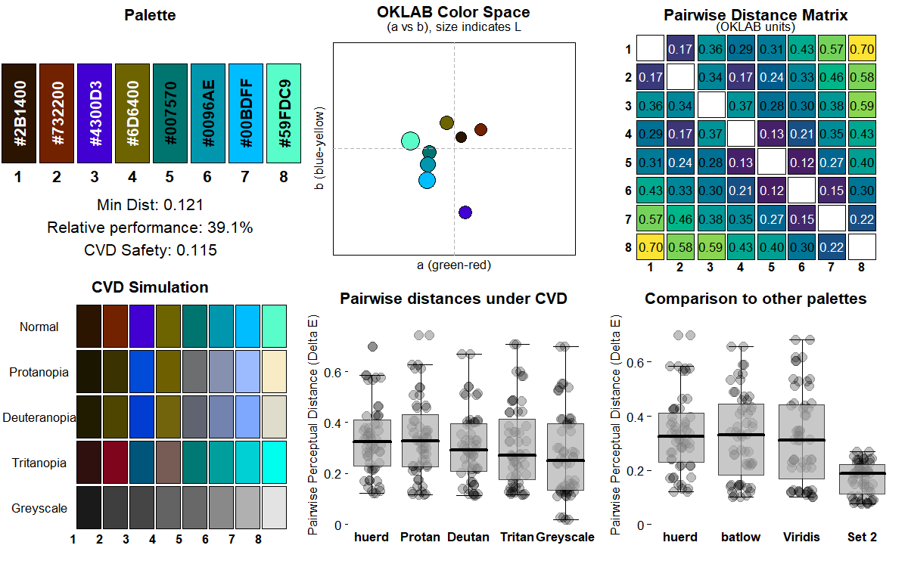

<!-- README.md is generated from README.Rmd. Please edit that file -->

# huerd <a href="https://sims1253.github.io/huerd/"></a>

<!-- badges: start -->

[](LICENSE)
[](https://github.com/sims1253/huerd/actions/workflows/R-CMD-check.yaml)
[](https://github.com/sims1253/huerd/actions/workflows/test-coverage.yaml)
[](https://app.codecov.io/gh/sims1253/huerd)
[](https://github.com/sims1253/huerd/actions/workflows/pkgdown.yaml)
[](https://lifecycle.r-lib.org/articles/stages.html#experimental)
<!-- badges: end -->

A discrete color palette generator with support for fixed colors,
optimized for color vision deficient viewers.

## Installation

You can install the development version of huerd from GitHub with:

``` r
# install.packages("pak")
pak::pak("sims1253/huerd")
```

## Basic Example

Generate a palette with 5 colors:

``` r
library(huerd)

palette <- generate_palette(8)
print(palette)
#> 
#> -- huerd Color Palette (8 colors) --
#> Colors:
#> [ 1] #002700
#> [ 2] #8B0000
#> [ 3] #FF0000
#> [ 4] #008BFF
#> [ 5] #FF00FF
#> [ 6] #00C100
#> [ 7] #FF8400
#> [ 8] #00F64B
#> 
#> -- Quality Metrics Summary --
#> * Min. Perceptual Distance (OKLAB): 0.146
#> * Optimizer Performance Ratio      : 47.1%
#> * Min. CVD-Safe Distance (OKLAB)  : 0.053
#> 
#> -- Generation Details --
#> * Optimizer Iterations: 667
#> * Optimizer Status: NLOPT_XTOL_REACHED: Optimization stopped because xtol_rel or xtol_abs (above) was reached.
```

## Constrained Color Palettes

Include specific colors while optimizing the remaining colors:

``` r
library(huerd)

palette <- generate_palette(
  n = 8,
  include_colors = c("#4A6B8A", "#E5A04C")
)
print(palette)
#> 
#> -- huerd Color Palette (8 colors) --
#> Colors:
#> [ 1] #4A6B8A
#> [ 2] #FF0000
#> [ 3] #B582A6
#> [ 4] #9699F4
#> [ 5] #E5A04C
#> [ 6] #1CD4AC
#> [ 7] #FFB4FF
#> [ 8] #C4EA3E
#> 
#> -- Quality Metrics Summary --
#> * Min. Perceptual Distance (OKLAB): 0.121
#> * Optimizer Performance Ratio      : 38.9%
#> * Min. CVD-Safe Distance (OKLAB)  : 0.111
#> 
#> -- Generation Details --
#> * Optimizer Iterations: 535
#> * Optimizer Status: NLOPT_XTOL_REACHED: Optimization stopped because xtol_rel or xtol_abs (above) was reached.
```

## Diagnostic Dashboard

Analyze palette quality with a dashboard:

``` r
library(huerd)

palette <- generate_palette(8)
plot_palette_analysis(palette)
```



## Palette Quality Evaluation

Pure data provider for detailed post-hoc analysis:

``` r
library(huerd)

palette <- generate_palette(8)
evaluation <- evaluate_palette(palette)

# Access raw metrics (no subjective scoring)
cat("Minimum distance:", evaluation$distances$min, "\n")
#> Minimum distance: 0.1876987
cat("Performance ratio:", evaluation$distances$performance_ratio * 100, "%\n")
#> Performance ratio: 60.57468 %
cat("CVD worst case:", evaluation$cvd_safety$worst_case_min_distance, "\n")
#> CVD worst case: 0.148669
```

## Custom Parameters

Fine-tune the generation process:

``` r
library(huerd)

palette <- generate_palette(
  n = 8,
  initialization = "harmony",              # Color harmony-based initialization
  init_lightness_bounds = c(0.3, 0.8),    # Constrain lightness range
  max_iterations = 2000                    # Show progress
)
print(palette)
#> 
#> -- huerd Color Palette (8 colors) --
#> Colors:
#> [ 1] #8C8C33
#> [ 2] #CE778E
#> [ 3] #9A8EE0
#> [ 4] #64BC5F
#> [ 5] #D29CC4
#> [ 6] #FFA6F7
#> [ 7] #C7E2DC
#> [ 8] #FFE6A9
#> 
#> -- Quality Metrics Summary --
#> * Min. Perceptual Distance (OKLAB): 0.097
#> * Optimizer Performance Ratio      : 31.4%
#> * Min. CVD-Safe Distance (OKLAB)  : 0.080
#> 
#> -- Generation Details --
#> * Optimizer Iterations: 913
#> * Optimizer Status: NLOPT_XTOL_REACHED: Optimization stopped because xtol_rel or xtol_abs (above) was reached.
```

## Complete Workflow Example

``` r
library(huerd)

# 1. Generate brand palette
brand_palette <- generate_palette(
  n = 8,
  include_colors = c("#1f77b4", "#ff7f0e"),  # Fixed brand colors
  fixed_aesthetic_influence = 0.9,
  initialization = "harmony",
  return_metrics = TRUE,
  progress = TRUE
)
#> Preparing for palette generation...
#> Adapting initialization from fixed colors' aesthetics...
#> Initializing 6 free colors (method: harmony)...
#> Optimizing 6 free colors...
#> Finalizing palette...
#> Done.

# 2. Diagnostic analysis
plot_palette_analysis(brand_palette)
```


``` r

# 3. Quality evaluation
evaluation <- evaluate_palette(brand_palette)
cat("Min distance:", round(evaluation$distances$min, 3), "\n")
#> Min distance: 0.178
cat("Performance:", round(evaluation$distances$performance_ratio * 100, 1), "%\n")
#> Performance: 57.6 %

# 4. CVD accessibility check
cvd_safe <- is_cvd_safe(brand_palette)
if (cvd_safe) {
  cat("Palette is CVD-accessible\n")
} else {
  cat("Palette may challenge CVD viewers\n")
}
#> Palette is CVD-accessible

# 5. CVD simulation for verification
cvd_simulation <- simulate_palette_cvd(brand_palette, cvd_type = "all")
print(cvd_simulation)
#> 
#> -- huerd CVD Simulation Result (Multiple Types, Severity: 1.00) --
#> Palette for: original
#>   [ 1] #6A464C
#>   [ 2] #8900FF
#>   [ 3] #1F77B4
#>   [ 4] #FF7F0E
#>   [ 5] #47C3A1
#>   [ 6] #E18DFF
#>   [ 7] #C4ED58
#>   [ 8] #00FFFF
#> Palette for: protan
#>   [ 1] #4C4C4C
#>   [ 2] #0064FF
#>   [ 3] #5A79B7
#>   [ 4] #A59100
#>   [ 5] #BDB79F
#>   [ 6] #79A9FF
#>   [ 7] #FADF45
#>   [ 8] #EDF2FF
#> Palette for: deutan
#>   [ 1] #54524B
#>   [ 2] #0060FB
#>   [ 3] #456CB3
#>   [ 4] #C4AE05
#>   [ 5] #ACAAA3
#>   [ 6] #90B1FC
#>   [ 7] #F5DE63
#>   [ 8] #D0DDFF
#> Palette for: tritan
#>   [ 1] #704348
#>   [ 2] #676496
#>   [ 3] #00868D
#>   [ 4] #FF616D
#>   [ 5] #00C5B9
#>   [ 6] #E09DBA
#>   [ 7] #CDE2CE
#>   [ 8] #00FFFE

# 6. Display final palette (colors are brightness-sorted)
print(brand_palette)
#> 
#> -- huerd Color Palette (8 colors) --
#> Colors:
#> [ 1] #6A464C
#> [ 2] #8900FF
#> [ 3] #1F77B4
#> [ 4] #FF7F0E
#> [ 5] #47C3A1
#> [ 6] #E18DFF
#> [ 7] #C4ED58
#> [ 8] #00FFFF
#> 
#> -- Quality Metrics Summary --
#> * Min. Perceptual Distance (OKLAB): 0.178
#> * Optimizer Performance Ratio      : 57.6%
#> * Min. CVD-Safe Distance (OKLAB)  : 0.123
#> 
#> -- Generation Details --
#> * Optimizer Iterations: 351
#> * Optimizer Status: NLOPT_XTOL_REACHED: Optimization stopped because xtol_rel or xtol_abs (above) was reached.
```
