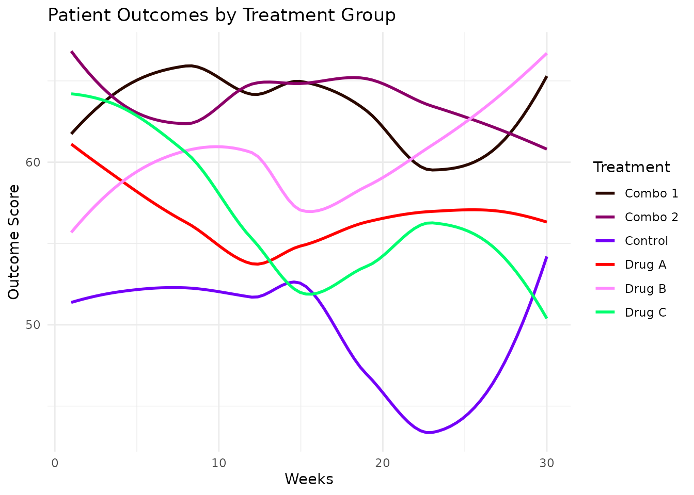
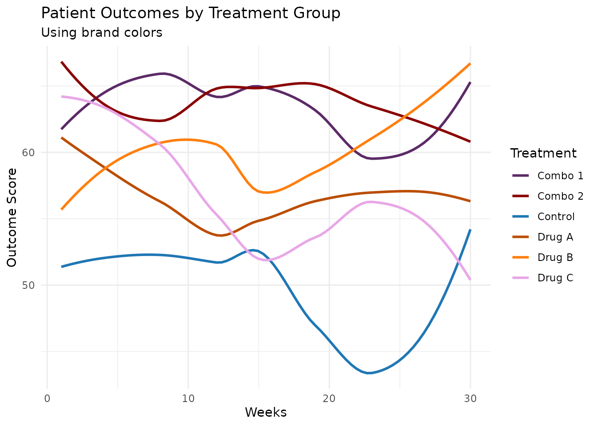
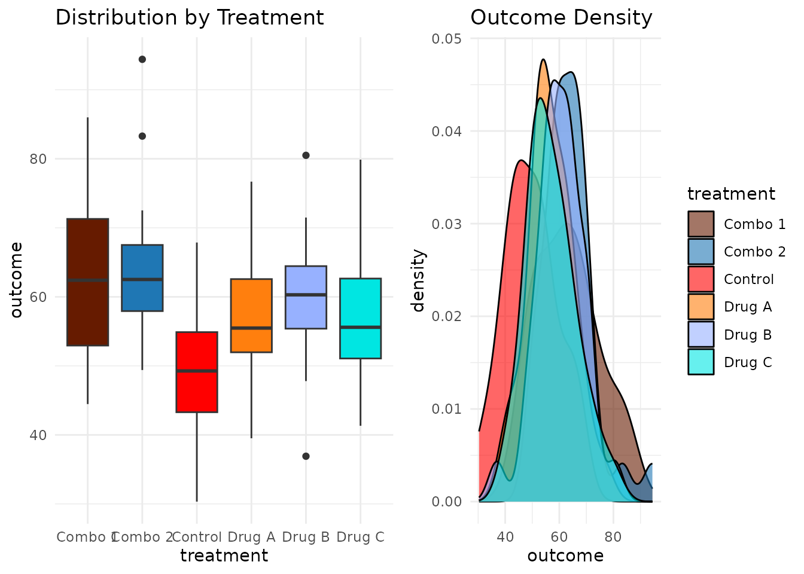
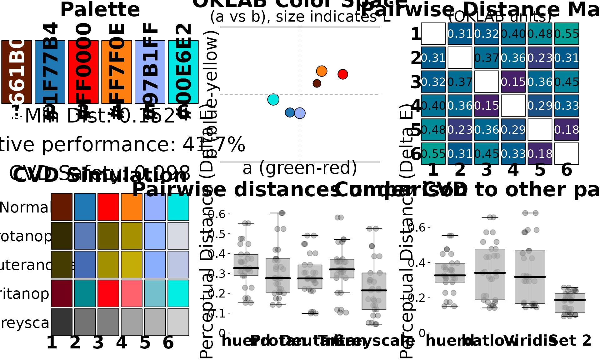
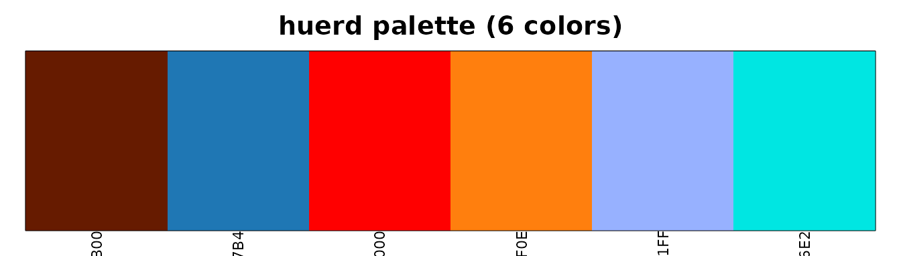

# Workflow: Data Scientist Creating Accessible Dashboards

## The Scenario

You’re a data scientist creating a dashboard to visualize patient
outcomes across treatment groups. Your requirements are:

- **6 distinct colors** for different treatment groups
- **CVD-safe** for accessibility compliance  
- **Include company brand colors** (a specific blue and orange)
- **Easy integration** with ggplot2

This vignette shows how huerd makes this workflow simple and reliable.

## Quick Start: The Simple Path

For many use cases,
[`quick_palette()`](https://sims1253.github.io/huerd/branch/docs/clarity-pass/reference/quick_palette.md)
is all you need:

``` r

library(huerd)

# Generate a 6-color accessible palette
palette <- quick_palette(6)
print(palette)
#> 
#> -- huerd Color Palette (6 colors) --
#> Colors:
#> [ 1] #4C0E00
#> [ 2] #002E8E
#> [ 3] #9A00FF
#> [ 4] #FF0025
#> [ 5] #00FFF5
#> [ 6] #EFE600
#> 
#> -- Quality Metrics Summary --
#> * Min. Perceptual Distance (OKLAB): 0.233
#> * Optimizer Performance Ratio      : 63.7%
#> * Min. CVD-Safe Distance (OKLAB)  : 0.201
#> 
#> -- Generation Details --
#> * Optimizer Iterations: 401
#> * Optimizer Status: NLOPT_XTOL_REACHED: Optimization stopped because xtol_rel or xtol_abs (above) was reached.
```

Want to include your brand colors? Just add them:

``` r

brand_palette <- quick_palette(
  n = 6,
  brand_colors = c("#1f77b4", "#ff7f0e")  # Your blue and orange
)
print(brand_palette)
#> 
#> -- huerd Color Palette (6 colors) --
#> Colors:
#> [ 1] #430096
#> [ 2] #1F77B4
#> [ 3] #FF7F0E
#> [ 4] #B19EFF
#> [ 5] #00FFFF
#> [ 6] #FFEE00
#> 
#> -- Quality Metrics Summary --
#> * Min. Perceptual Distance (OKLAB): 0.230
#> * Optimizer Performance Ratio      : 63.0%
#> * Min. CVD-Safe Distance (OKLAB)  : 0.173
#> 
#> -- Generation Details --
#> * Optimizer Iterations: 210
#> * Optimizer Status: NLOPT_XTOL_REACHED: Optimization stopped because xtol_rel or xtol_abs (above) was reached.
```

## Using Palettes with ggplot2

huerd integrates natively with ggplot2, so you no longer need
[`scale_color_manual()`](https://ggplot2.tidyverse.org/reference/scale_manual.html):

``` r

library(ggplot2)

# Simulate treatment outcome data
set.seed(123)
treatment_data <- data.frame(
  patient_id = 1:180,
  treatment = rep(c("Control", "Drug A", "Drug B", "Drug C", "Combo 1", "Combo 2"), each = 30),
  outcome = c(
    rnorm(30, 50, 10),
    rnorm(30, 55, 10),
    rnorm(30, 60, 10),
    rnorm(30, 58, 10),
    rnorm(30, 65, 10),
    rnorm(30, 62, 10)
  ),
  time_weeks = rep(1:30, 6)
)

# Plot with automatic huerd palette
ggplot(treatment_data, aes(x = time_weeks, y = outcome, color = treatment)) +
  geom_smooth(method = "loess", se = FALSE) +
  scale_color_huerd() +
  labs(
    title = "Patient Outcomes by Treatment Group",
    x = "Weeks",
    y = "Outcome Score",
    color = "Treatment"
  ) +
  theme_minimal()
#> `geom_smooth()` using formula = 'y ~ x'
```



### With Brand Colors

Include your brand colors directly in the scale:

``` r

ggplot(treatment_data, aes(x = time_weeks, y = outcome, color = treatment)) +
  geom_smooth(method = "loess", se = FALSE) +
  scale_color_huerd(brand_colors = c("#1f77b4", "#ff7f0e")) +
  labs(
    title = "Patient Outcomes by Treatment Group",
    subtitle = "Using brand colors",
    x = "Weeks",
    y = "Outcome Score",
    color = "Treatment"
  ) +
  theme_minimal()
#> `geom_smooth()` using formula = 'y ~ x'
```



### Using a Pre-Generated Palette

For consistent colors across multiple plots, generate once and reuse:

``` r

# Generate and save your palette
my_palette <- generate_palette(
  n = 6,
  include_colors = c("#1f77b4", "#ff7f0e"),
  progress = FALSE
)

# Use in multiple plots
p1 <- ggplot(treatment_data, aes(x = treatment, y = outcome, fill = treatment)) +
  geom_boxplot() +
  scale_fill_huerd(palette = my_palette) +
  labs(title = "Distribution by Treatment") +
  theme_minimal() +
  theme(legend.position = "none")

p2 <- ggplot(treatment_data, aes(x = outcome, fill = treatment)) +
  geom_density(alpha = 0.6) +
  scale_fill_huerd(palette = my_palette) +
  labs(title = "Outcome Density") +
  theme_minimal()

# Display side by side
gridExtra::grid.arrange(p1, p2, ncol = 2)
```



## Verifying Accessibility

Before finalizing your dashboard, verify accessibility:

### Quick Check

``` r

is_cvd_safe(my_palette)
#> [1] TRUE
```

### Detailed Assessment

``` r

interpret_palette_quality(my_palette)
#> 
#> ── Palette Quality Assessment ──
#> 
#> This 6-color palette is well optimized (42% of theoretical maximum). Excellent
#> - colors are highly distinct and easy to differentiate
#> 
#> ── Distinctness
#> Excellent - colors are highly distinct and easy to differentiate
#> 
#> ── Accessibility
#> Good - palette should work for most viewers with CVD
```

### Full Evaluation

``` r

evaluation <- evaluate_palette(my_palette)

# Key metrics for your accessibility report
cat("Minimum color distance:", round(evaluation$distances$min, 3), "\n")
#> Minimum color distance: 0.152
cat("CVD worst-case distance:", round(evaluation$cvd_safety$worst_case_min_distance, 3), "\n")
#> CVD worst-case distance: 0.098
cat("Performance ratio:", round(evaluation$distances$performance_ratio * 100, 1), "%\n")
#> Performance ratio: 41.7 %
```

## Visual Diagnostics

For presentations or documentation, use the analysis dashboard:

``` r

plot_palette_analysis(my_palette)
```



Or the simple swatch view:

``` r

plot(my_palette)
```



## Summary

For data scientists, huerd provides:

1.  **[`quick_palette()`](https://sims1253.github.io/huerd/branch/docs/clarity-pass/reference/quick_palette.md)** -
    Fast, sensible defaults
2.  **[`scale_color_huerd()`](https://sims1253.github.io/huerd/branch/docs/clarity-pass/reference/scale_color_huerd.md)
    /
    [`scale_fill_huerd()`](https://sims1253.github.io/huerd/branch/docs/clarity-pass/reference/scale_color_huerd.md)** -
    Native ggplot2 integration
3.  **[`is_cvd_safe()`](https://sims1253.github.io/huerd/branch/docs/clarity-pass/reference/is_cvd_safe.md)** -
    Quick accessibility verification
4.  **[`interpret_palette_quality()`](https://sims1253.github.io/huerd/branch/docs/clarity-pass/reference/interpret_palette_quality.md)** -
    Human-readable quality assessment
5.  **[`plot_palette_analysis()`](https://sims1253.github.io/huerd/branch/docs/clarity-pass/reference/plot_palette_analysis.md)** -
    Full visual diagnostics

This workflow ensures your visualizations are beautiful and accessible.
