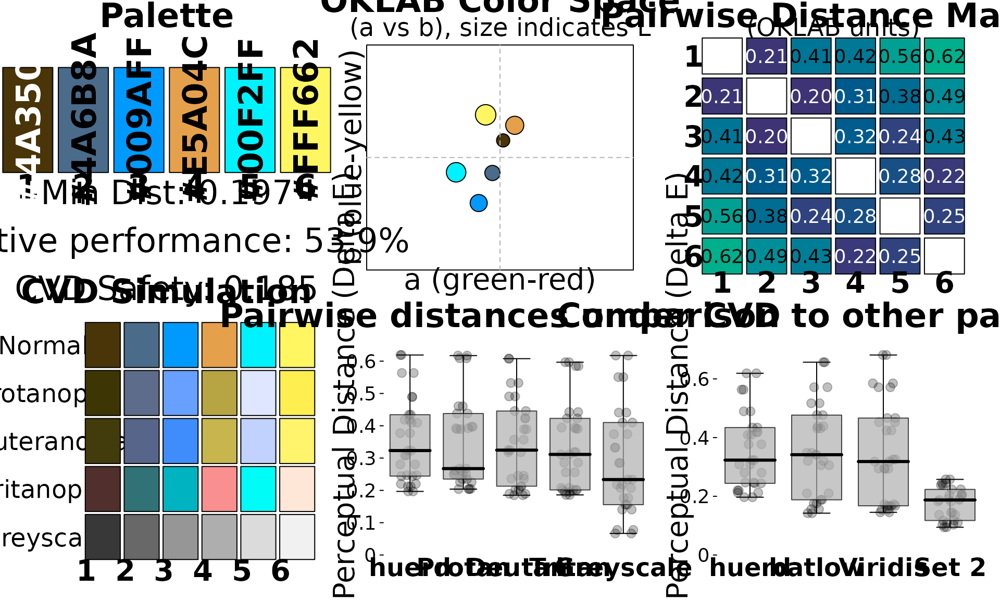

# Introduction to huerd

## Introduction

The `huerd` package generates categorical color palettes with pure
minimax optimization in the perceptually uniform OKLAB color space, so
the colors are maximally distinct.

This vignette covers the core features of `huerd`, from basic palette
generation to in-depth analysis.

## Installation

You can install the development version of `huerd` from GitHub with:

``` r

# install.packages("remotes")
# remotes::install_github("sims1253/huerd")
```

## Basic Palette Generation

The simplest way to use `huerd` is with the
[`generate_palette()`](https://sims1253.github.io/huerd/branch/docs/clarity-pass/reference/generate_palette.md)
function. By default, it creates a palette of the specified size with
colors as distinct as possible.

``` r

library(huerd)

# Generate a palette of 5 colors
palette <- generate_palette(5, progress = FALSE)
print(palette)
#> 
#> -- huerd Color Palette (5 colors) --
#> Colors:
#> [ 1] #002B62
#> [ 2] #9900FF
#> [ 3] #FF0041
#> [ 4] #FFCE00
#> [ 5] #00FFFF
#> 
#> -- Quality Metrics Summary --
#> * Min. Perceptual Distance (OKLAB): 0.264
#> * Optimizer Performance Ratio      : 64.2%
#> * Min. CVD-Safe Distance (OKLAB)  : 0.227
#> 
#> -- Generation Details --
#> * Optimizer Iterations: 307
#> * Optimizer Status: NLOPT_XTOL_REACHED: Optimization stopped because xtol_rel or xtol_abs (above) was reached.
```

huerd automatically sorts every palette by brightness (OKLAB lightness).

## Constrained Palettes

You can include fixed “brand” colors in your palette while `huerd`
optimizes the remaining colors around them.

``` r

# Generate a 6-color palette that must include a specific blue and orange
brand_palette <- generate_palette(
  n = 6,
  include_colors = c("#4A6B8A", "#E5A04C"),
  progress = FALSE
)
print(brand_palette)
#> 
#> -- huerd Color Palette (6 colors) --
#> Colors:
#> [ 1] #4A3509
#> [ 2] #4A6B8A
#> [ 3] #009AFF
#> [ 4] #E5A04C
#> [ 5] #00F2FF
#> [ 6] #FFF662
#> 
#> -- Quality Metrics Summary --
#> * Min. Perceptual Distance (OKLAB): 0.197
#> * Optimizer Performance Ratio      : 53.9%
#> * Min. CVD-Safe Distance (OKLAB)  : 0.185
#> 
#> -- Generation Details --
#> * Optimizer Iterations: 269
#> * Optimizer Status: NLOPT_XTOL_REACHED: Optimization stopped because xtol_rel or xtol_abs (above) was reached.
```

## Palette Analysis

`huerd` includes tools for analyzing the quality of your palettes.

### `evaluate_palette()`

[`evaluate_palette()`](https://sims1253.github.io/huerd/branch/docs/clarity-pass/reference/evaluate_palette.md)
gives a detailed, quantitative assessment of a palette’s properties.

``` r

# Evaluate the brand palette we just created
evaluation <- evaluate_palette(brand_palette)
print(evaluation)
#> 
#> -- huerd Palette Evaluation (6 colors) --
#> 
#> -- Perceptual Distances (OKLAB) --
#> * Min distance       : 0.1969
#> * Mean distance      : 0.3562
#> * Median distance    : 0.3232
#> * Std. Dev.          : 0.1313
#> * Estimated Max Min  : 0.3655 (for unconstrained palette of this size)
#> * Performance Ratio  : 53.9% (achieved min / estimated max)
#> 
#> -- CVD Safety (OKLAB distances under simulation) --
#> * Worst-case min dist: 0.1851
#>   Protanopia : min=0.204, preserved_ratio=1.04
#>   Deuteranopia: min=0.185, preserved_ratio=0.94
#>   Tritanopia : min=0.186, preserved_ratio=0.94
#> 
#> -- Color Distribution (OKLAB) --
#> * Lightness (L)    : range=[0.34, 0.95], mean=0.69
#> * Chroma (C)       : range=[0.063, 0.183], mean=0.126
#> * Hue (degrees)    : circular_variance=0.737
```

This function returns detailed information, including:

- **Perceptual Distances**: Minimum, mean, and other statistics about
  the distances between colors.
- **CVD Safety**: How the palette performs under simulated color vision
  deficiency.
- **Color Distribution**: Statistics on the spread of lightness, chroma,
  and hue.

### `plot_palette_analysis()`

For a more visual analysis,
[`plot_palette_analysis()`](https://sims1253.github.io/huerd/branch/docs/clarity-pass/reference/plot_palette_analysis.md)
creates a diagnostic dashboard.

``` r

# Create the diagnostic dashboard
plot_palette_analysis(brand_palette)
```



This dashboard provides six key visualizations:

1.  **Color Swatches**: An overview of the palette with key metrics.
2.  **OKLAB Color Space**: A projection of the colors in the `a*b*`
    plane; point size indicates lightness.
3.  **Pairwise Distance Matrix**: A heatmap of the perceptual distance
    between every pair of colors, on a fixed scale so cell colors are
    comparable across palettes.
4.  **CVD Simulation**: How the palette appears to viewers with the
    three most common types of color vision deficiency, plus greyscale.
5.  **Pairwise Distances under CVD**: The distribution of pairwise
    distances under each CVD simulation, compared with normal vision.
6.  **Comparative Palettes**: A comparison of your palette’s distance
    distribution against established palettes like Batlow, Viridis, and
    Set2.

## CVD Accessibility

`huerd` provides two main tools for working with CVD.

### `is_cvd_safe()`

This function checks programmatically whether a palette meets a minimum
threshold for CVD safety.

``` r

is_cvd_safe(brand_palette)
#> [1] TRUE
```

### `simulate_palette_cvd()`

This function shows how your palette would appear to viewers with
different types of CVD.

``` r

# Simulate the appearance for all CVD types
cvd_simulation <- simulate_palette_cvd(brand_palette, cvd_type = "all")
print(cvd_simulation)
#> 
#> -- huerd CVD Simulation Result (Multiple Types, Severity: 1.00) --
#> Palette for: original
#>   [ 1] #4A3509
#>   [ 2] #4A6B8A
#>   [ 3] #009AFF
#>   [ 4] #E5A04C
#>   [ 5] #00F2FF
#>   [ 6] #FFF662
#> Palette for: protan
#>   [ 1] #3D3503
#>   [ 2] #5E6C8B
#>   [ 3] #67A0FF
#>   [ 4] #B7A443
#>   [ 5] #DEE7FF
#>   [ 6] #FFEE50
#> Palette for: deutan
#>   [ 1] #423B0B
#>   [ 2] #566589
#>   [ 3] #3F8DFD
#>   [ 4] #C7B54E
#>   [ 5] #C1D2FF
#>   [ 6] #FFF46B
#> Palette for: tritan
#>   [ 1] #512F2D
#>   [ 2] #307275
#>   [ 3] #00B3C0
#>   [ 4] #F98F8E
#>   [ 5] #00FCF6
#>   [ 6] #FFE7D7
```

## Conclusion

This vignette has covered the core functionality of the `huerd` package.
By combining pure minimax optimization with its analysis tools, `huerd`
creates high-quality, accessible color palettes.
