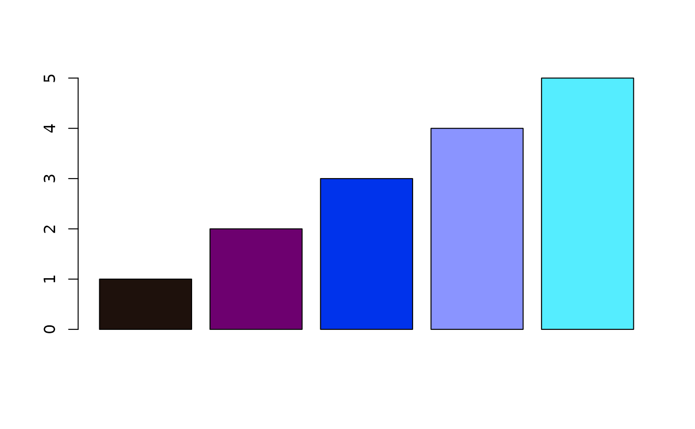
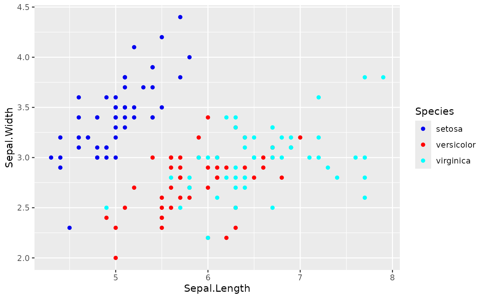
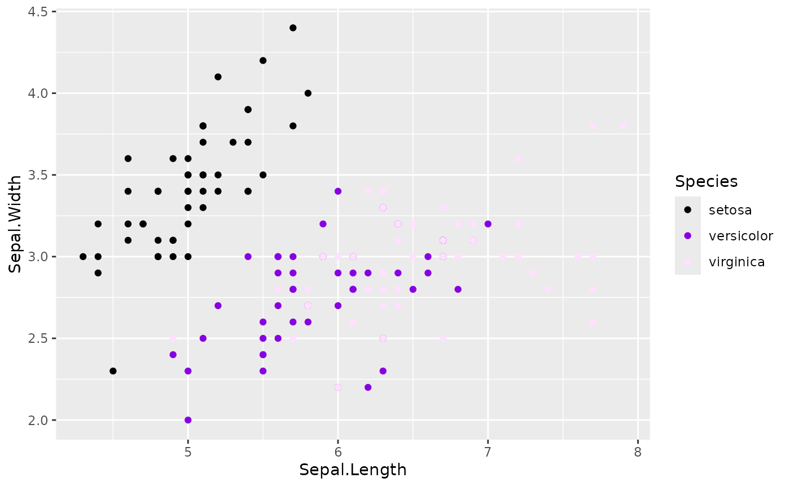

# Workflow: Package Developer Integrating huerd

## The Scenario

You’re developing an R package that includes visualization functions.
You want to:

- **Generate optimal palettes** automatically based on data
- **Ensure reproducibility** for scientific workflows
- **Handle edge cases** gracefully
- **Provide quality metrics** to users
- **Minimize dependencies** and runtime overhead

This vignette demonstrates how to integrate huerd into your package.

## Adding huerd as a Dependency

In your package’s `DESCRIPTION`:

    Imports:
        huerd

Or for optional functionality:

    Suggests:
        huerd

## Basic Integration Pattern

### Automatic Palette Generation

``` r

library(huerd)

# Function that automatically generates palettes
plot_clusters <- function(data, cluster_column, ...) {
  n_clusters <- length(unique(data[[cluster_column]]))
  
  # Generate optimal palette for this number of clusters
  palette <- generate_palette(
    n = n_clusters,
    progress = FALSE  # Silent for programmatic use
  )
  
  # Use the palette...
  list(
    n_clusters = n_clusters,
    palette = palette
  )
}

# Example usage
result <- plot_clusters(iris, "Species")
print(result$palette)
#> 
#> -- huerd Color Palette (3 colors) --
#> Colors:
#> [ 1] #7400E6
#> [ 2] #FF0000
#> [ 3] #D8FBFF
#> 
#> -- Quality Metrics Summary --
#> * Min. Perceptual Distance (OKLAB): 0.413
#> * Optimizer Performance Ratio      : 70.2%
#> * Min. CVD-Safe Distance (OKLAB)  : 0.332
#> 
#> -- Generation Details --
#> * Optimizer Iterations: 225
#> * Optimizer Status: NLOPT_XTOL_REACHED: Optimization stopped because xtol_rel or xtol_abs (above) was reached.
```

### Reproducible Palettes

For scientific workflows, ensure reproducibility:

``` r

# Set seed before generation
set.seed(42)
palette1 <- generate_palette(8, progress = FALSE)

# Same seed = same palette
set.seed(42)
palette2 <- generate_palette(8, progress = FALSE)

identical(as.character(palette1), as.character(palette2))
#> [1] TRUE
```

Or use the built-in reproduction:

``` r

original <- generate_palette(8, progress = FALSE)
reproduced <- reproduce_palette(original, progress = FALSE)

identical(as.character(original), as.character(reproduced))
#> [1] TRUE
```

## Accessing Optimization Metadata

huerd palettes include rich metadata for logging and debugging:

``` r

palette <- generate_palette(
  n = 8,
  return_metrics = TRUE,  # Include quality metrics
  progress = FALSE
)

# Access optimization details
opt_details <- attr(palette, "optimization_details")
str(opt_details)
#> List of 4
#>  $ iterations           : int 755
#>  $ status_message       : chr "NLOPT_XTOL_REACHED: Optimization stopped because xtol_rel or xtol_abs (above) was reached."
#>  $ nloptr_status        : num 4
#>  $ final_objective_value: num -0.127
#>  - attr(*, "class")= chr [1:2] "huerd_optimization_details" "list"

# Access quality metrics
metrics <- attr(palette, "metrics")
cat("Minimum distance:", metrics$distances$min, "\n")
#> Minimum distance: 0.1541632
cat("Performance ratio:", metrics$distances$performance_ratio, "\n")
#> Performance ratio: 0.4975199
```

## Choosing the Right Optimizer

Different optimizers suit different needs:

``` r

# COBYLA (default) - Good balance, deterministic
cobyla_pal <- generate_palette(6, optimizer = "nloptr_cobyla", progress = FALSE)

# SANN - Stochastic, may find better solutions
sann_pal <- generate_palette(6, optimizer = "sann", progress = FALSE)

# L-BFGS - Fast gradient-based, best with smooth objectives
lbfgs_pal <- generate_palette(
  6,
  optimizer = "nlopt_lbfgs",
  weights = c(smooth_repulsion = 1),
  progress = FALSE
)

# Compare results
cat("COBYLA min distance:", evaluate_palette(cobyla_pal)$distances$min, "\n")
#> COBYLA min distance: 0.1350284
cat("SANN min distance:", evaluate_palette(sann_pal)$distances$min, "\n")
#> SANN min distance: 0.2143331
cat("L-BFGS min distance:", evaluate_palette(lbfgs_pal)$distances$min, "\n")
#> L-BFGS min distance: 0.04296962
```

**Recommendations:** - Use `nloptr_cobyla` (default) for general use -
Use `sann` when quality is more important than speed - Use `nlopt_lbfgs`
with `smooth_repulsion` for fastest optimization

## Handling Edge Cases

### Single Color

``` r

single <- generate_palette(1, progress = FALSE)
print(single)
#> 
#> -- huerd Color Palette (1 color) --
#> Colors:
#> [ 1] #003600
#> 
#> -- Quality Metrics Summary --
#> * Min. Perceptual Distance (OKLAB): NA
#> * Optimizer Performance Ratio      : 0.0%
#> * Min. CVD-Safe Distance (OKLAB)  : NA
#> 
#> -- Generation Details --
#> * Optimizer Iterations: 34
#> * Optimizer Status: NLOPT_XTOL_REACHED: Optimization stopped because xtol_rel or xtol_abs (above) was reached.
length(single)
#> [1] 1
```

### Empty Palette

``` r

empty <- generate_palette(0, progress = FALSE)
print(empty)
#> 
#> -- huerd Color Palette (0 colors) --
#>   (empty palette)
#> 
#> -- Quality Metrics Summary --
#> * Min. Perceptual Distance (OKLAB): NA
#> * Optimizer Performance Ratio      : 0.0%
#> * Min. CVD-Safe Distance (OKLAB)  : NA
#> 
#> -- Generation Details --
#> * Optimizer Iterations: 0
#> * Optimizer Status: All colors fixed
length(empty)
#> [1] 0
```

### Large Palettes

``` r

# For many colors, consider limiting iterations for speed
large <- generate_palette(
  n = 15,
  max_iterations = 500,  # Faster but potentially lower quality
  progress = FALSE
)
print(large)
#> 
#> -- huerd Color Palette (15 colors) --
#> Colors:
#> [ 1] #002400
#> [ 2] #390D64
#> [ 3] #004330
#> [ 4] #890000
#> [ 5] #3C36A1
#> [ 6] #0050CD
#> [ 7] #BD0000
#> [ 8] #A900F3
#> [ 9] #917500
#> [10] #FF0000
#> [11] #FF00FF
#> [12] #FF676B
#> [13] #66BAFF
#> [14] #00ED00
#> [15] #00FFDE
#> 
#> -- Quality Metrics Summary --
#> * Min. Perceptual Distance (OKLAB): 0.096
#> * Optimizer Performance Ratio      : 45.2%
#> * Min. CVD-Safe Distance (OKLAB)  : 0.059
#> 
#> -- Generation Details --
#> * Optimizer Iterations: 502
#> * Optimizer Status: NLOPT_MAXEVAL_REACHED: Optimization stopped because maxeval (above) was reached.
```

## Evaluating External Palettes

Your package might want to compare huerd palettes against user-provided
ones:

``` r

# Evaluate any vector of hex colors
viridis_colors <- c("#440154", "#3B528B", "#21918C", "#5DC863", "#FDE725")

eval_viridis <- evaluate_palette(viridis_colors)
cat("Viridis (5 colors):\n")
#> Viridis (5 colors):
cat("  Min distance:", round(eval_viridis$distances$min, 3), "\n")
#>   Min distance: 0.19
cat("  CVD safety:", round(eval_viridis$cvd_safety$worst_case_min_distance, 3), "\n")
#>   CVD safety: 0.142

# Compare with huerd
huerd_colors <- generate_palette(5, progress = FALSE)
eval_huerd <- evaluate_palette(huerd_colors)
cat("\nhuerd (5 colors):\n")
#> 
#> huerd (5 colors):
cat("  Min distance:", round(eval_huerd$distances$min, 3), "\n")
#>   Min distance: 0.266
cat("  CVD safety:", round(eval_huerd$cvd_safety$worst_case_min_distance, 3), "\n")
#>   CVD safety: 0.228
```

## Palette Objects as Character Vectors

huerd palettes work seamlessly as character vectors:

``` r

palette <- generate_palette(5, progress = FALSE)

# Standard vector operations
length(palette)
#> [1] 5
palette[1:3]
#> [1] "#1E110C" "#6D006F" "#0033EB"
rev(palette)
#> [1] "#55EDFF" "#8A94FF" "#0033EB" "#6D006F" "#1E110C"
paste(palette, collapse = ", ")
#> [1] "#1E110C, #6D006F, #0033EB, #8A94FF, #55EDFF"

# Coercion
as.character(palette)
#> [1] "#1E110C" "#6D006F" "#0033EB" "#8A94FF" "#55EDFF"

# Works with base R graphics
barplot(1:5, col = palette)
```



## Integration with ggplot2

If your package uses ggplot2, huerd provides native scales:

``` r

library(ggplot2)

# Automatic palette
ggplot(iris, aes(Sepal.Length, Sepal.Width, color = Species)) +
  geom_point() +
  scale_color_huerd()
```



``` r


# Pre-generated palette for consistency
my_palette <- generate_palette(3, progress = FALSE)

ggplot(iris, aes(Sepal.Length, Sepal.Width, color = Species)) +
  geom_point() +
  scale_color_huerd(palette = my_palette)
```



## Conditional huerd Usage

If huerd is in `Suggests`, check for availability:

``` r

my_plot_function <- function(data, ...) {
  n_groups <- length(unique(data$group))
  
  if (requireNamespace("huerd", quietly = TRUE)) {
    palette <- huerd::generate_palette(n_groups, progress = FALSE)
  } else {
    # Fallback to default colors
    palette <- grDevices::hcl.colors(n_groups, "Set2")
  }
  
  # Use palette...
}
```

## Performance Considerations

``` r

# Benchmark different configurations
library(huerd)

# Fast generation (exploration)
# Expected runtime: ~0.1-0.3 seconds (low iterations for quick exploration)
system.time({
  fast <- generate_palette(8, max_iterations = 100, progress = FALSE)
})
#>    user  system elapsed 
#>   0.438   0.000   0.438

# Default generation
# Expected runtime: ~0.5-2.0 seconds (balanced iteration count for good quality)
system.time({
  default <- generate_palette(8, progress = FALSE)
})
#>    user  system elapsed 
#>   1.080   0.000   1.079

# High quality generation
# Expected runtime: ~2.0-8.0 seconds (high iterations for maximum quality)
system.time({
  quality <- generate_palette(8, max_iterations = 3000, progress = FALSE)
})
#>    user  system elapsed 
#>   0.752   0.000   0.751
```

For performance-critical applications:

1.  **Cache palettes** - Generate once, reuse across plots
2.  **Use `max_iterations`** - Lower values for faster (but potentially
    lower quality) results
3.  **Use `nlopt_lbfgs`** - Fastest optimizer for smooth objectives

## Summary

For package developers, huerd provides:

1.  **Programmatic API** - `progress = FALSE` for silent operation
2.  **Reproducibility** - Seed control and
    [`reproduce_palette()`](https://sims1253.github.io/huerd/branch/refactor/deduplicate-optimizers/reference/reproduce_palette.md)
3.  **Rich metadata** - `attr(palette, "optimization_details")` for
    logging
4.  **Multiple optimizers** - Choose speed vs. quality
5.  **Edge case handling** - Works with n=0, n=1, large n
6.  **Standard R integration** - Works as character vector
7.  **ggplot2 scales** - Native
    [`scale_color_huerd()`](https://sims1253.github.io/huerd/branch/refactor/deduplicate-optimizers/reference/scale_color_huerd.md)
    integration
8.  **External evaluation** -
    [`evaluate_palette()`](https://sims1253.github.io/huerd/branch/refactor/deduplicate-optimizers/reference/evaluate_palette.md)
    works on any colors

This makes huerd suitable for both interactive use and integration into
automated pipelines.
