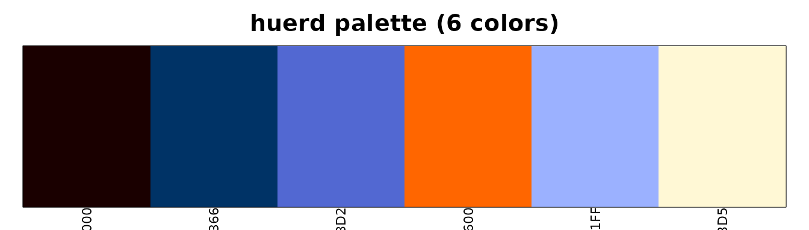
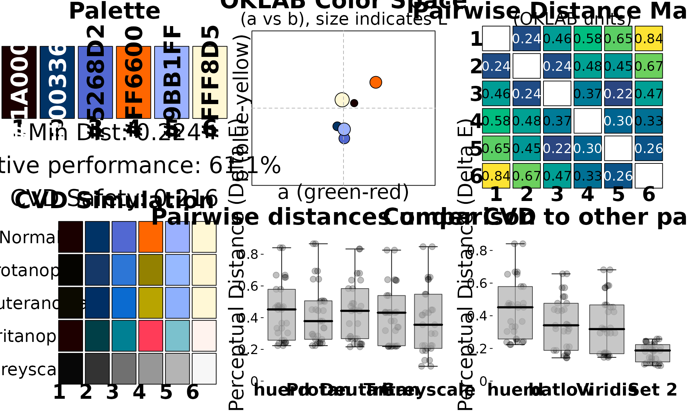
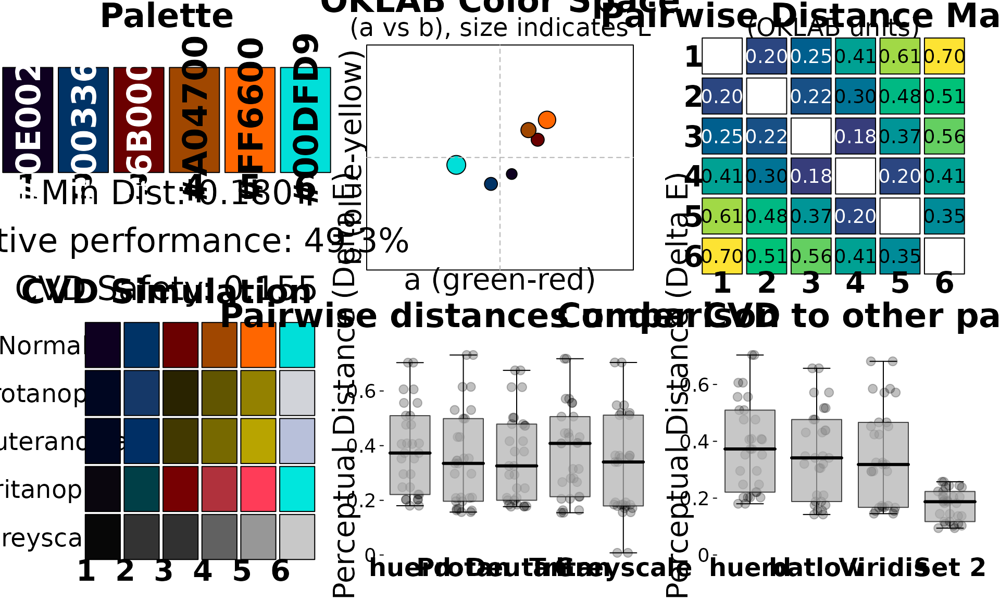

# Workflow: Designer Creating Brand-Compliant Palettes

## The Scenario

You’re a designer creating a color palette for a client’s annual report.
Your requirements are:

- **Include specific brand colors** that the client requires
- **Generate complementary colors** that work with the brand
- **Ensure accessibility** for compliance requirements
- **Export to multiple formats** (CSS, Sass, etc.)
- **Document and justify** your color choices

This vignette shows how huerd simplifies brand-compliant palette
creation.

## Starting with Brand Colors

Use
[`brand_palette()`](https://sims1253.github.io/huerd/branch/refactor/remove-dead-code/reference/brand_palette.md)
when you have specific colors that must be included:

``` r

library(huerd)

# Client's brand colors
client_navy <- "#003366"
client_orange <- "#FF6600"

# Create a 6-color palette around the brand
palette <- brand_palette(
  brand_colors = c(client_navy, client_orange),
  n_total = 6
)

print(palette)
#> 
#> -- huerd Color Palette (6 colors) --
#> Colors:
#> [ 1] #1A0000
#> [ 2] #003366
#> [ 3] #5268D2
#> [ 4] #FF6600
#> [ 5] #9BB1FF
#> [ 6] #FFF8D5
#> 
#> -- Quality Metrics Summary --
#> * Min. Perceptual Distance (OKLAB): 0.224
#> * Optimizer Performance Ratio      : 61.1%
#> * Min. CVD-Safe Distance (OKLAB)  : 0.216
#> 
#> -- Generation Details --
#> * Optimizer Iterations: 265
#> * Optimizer Status: NLOPT_XTOL_REACHED: Optimization stopped because xtol_rel or xtol_abs (above) was reached.
```

The brand colors are preserved exactly, and huerd generates optimized
complementary colors.

## Visualizing Your Palette

See your palette at a glance:

``` r

plot(palette)
```



For client presentations, use the full analysis dashboard:

``` r

plot_palette_analysis(palette)
```



## Controlling Lightness for Print

For print materials, you may want to avoid very light or very dark
colors:

``` r

# Mid-range lightness for better print reproduction
print_palette <- quick_palette(
  n = 6,
  brand_colors = c(client_navy, client_orange),
  lightness = "mid"  # Avoids extremes
)

print(print_palette)
#> 
#> -- huerd Color Palette (6 colors) --
#> Colors:
#> [ 1] #210000
#> [ 2] #003366
#> [ 3] #AB54FF
#> [ 4] #FF6600
#> [ 5] #7EC6FF
#> [ 6] #FFDC87
#> 
#> -- Quality Metrics Summary --
#> * Min. Perceptual Distance (OKLAB): 0.228
#> * Optimizer Performance Ratio      : 62.4%
#> * Min. CVD-Safe Distance (OKLAB)  : 0.204
#> 
#> -- Generation Details --
#> * Optimizer Iterations: 524
#> * Optimizer Status: NLOPT_XTOL_REACHED: Optimization stopped because xtol_rel or xtol_abs (above) was reached.
```

Or specify custom bounds:

``` r

# Very specific lightness range
controlled_palette <- generate_palette(
  n = 6,
  include_colors = c(client_navy, client_orange),
  init_lightness_bounds = c(0.3, 0.7),  # 30% to 70% lightness
  progress = FALSE
)
```

## Documenting for Stakeholders

### Human-Readable Quality Assessment

``` r

quality <- interpret_palette_quality(palette)
print(quality)
#> 
#> ── Palette Quality Assessment ──
#> 
#> This 6-color palette is highly optimized (61% of theoretical maximum).
#> Excellent - colors are highly distinct and easy to differentiate
#> 
#> ── Distinctness
#> Excellent - colors are highly distinct and easy to differentiate
#> 
#> ── Accessibility
#> Excellent - palette is safe for most color vision deficiencies
```

This gives you language you can use directly in client presentations.

### Technical Metrics

For detailed documentation:

``` r

evaluation <- evaluate_palette(palette)

cat("=== Palette Quality Report ===\n\n")
#> === Palette Quality Report ===
cat("Number of colors:", evaluation$n_colors, "\n")
#> Number of colors: 6
cat("Minimum perceptual distance:", round(evaluation$distances$min, 3), "\n")
#> Minimum perceptual distance: 0.224
cat("Mean perceptual distance:", round(evaluation$distances$mean, 3), "\n")
#> Mean perceptual distance: 0.438
cat("Optimization performance:", round(evaluation$distances$performance_ratio * 100, 1), "%\n")
#> Optimization performance: 61.1 %
cat("\n=== Accessibility ===\n")
#> 
#> === Accessibility ===
cat("CVD worst-case distance:", round(evaluation$cvd_safety$worst_case_min_distance, 3), "\n")
#> CVD worst-case distance: 0.216
cat("CVD-safe:", is_cvd_safe(palette), "\n")
#> CVD-safe: TRUE
```

## CVD Simulation for Compliance

Show stakeholders how the palette appears to colorblind viewers:

``` r

cvd_sim <- simulate_palette_cvd(palette, cvd_type = "all")
print(cvd_sim)
#> 
#> -- huerd CVD Simulation Result (Multiple Types, Severity: 1.00) --
#> Palette for: original
#>   [ 1] #1A0000
#>   [ 2] #003366
#>   [ 3] #5268D2
#>   [ 4] #FF6600
#>   [ 5] #9BB1FF
#>   [ 6] #FFF8D5
#> Palette for: protan
#>   [ 1] #050400
#>   [ 2] #153868
#>   [ 3] #2D76D6
#>   [ 4] #938100
#>   [ 5] #97B9FF
#>   [ 6] #FFF6D3
#> Palette for: deutan
#>   [ 1] #0C0A00
#>   [ 2] #002F65
#>   [ 3] #0B6BD0
#>   [ 4] #B8A400
#>   [ 5] #8EB0FD
#>   [ 6] #FFF8D6
#> Palette for: tritan
#>   [ 1] #1E0000
#>   [ 2] #003F47
#>   [ 3] #008093
#>   [ 4] #FF3C58
#>   [ 5] #7BC1CD
#>   [ 6] #FFF3EE
```

## Exporting Your Palette

huerd can export to multiple formats for development handoff:

### CSS Custom Properties

``` r

css_output <- export_palette(
  palette,
  format = "css",
  names = c("brand-navy", "brand-orange", "accent-1", "accent-2", "accent-3", "accent-4")
)
cat(css_output)
#> :root {
#>   --brand-navy: #1A0000;
#>   --brand-orange: #003366;
#>   --accent-1: #5268D2;
#>   --accent-2: #FF6600;
#>   --accent-3: #9BB1FF;
#>   --accent-4: #FFF8D5;
#> }
```

### Sass Variables

``` r

sass_output <- export_palette(
  palette,
  format = "sass",
  names = c("brand-navy", "brand-orange", "accent-1", "accent-2", "accent-3", "accent-4")
)
cat(sass_output)
#> $brand-navy: #1A0000;
#> $brand-orange: #003366;
#> $accent-1: #5268D2;
#> $accent-2: #FF6600;
#> $accent-3: #9BB1FF;
#> $accent-4: #FFF8D5;
```

### JSON for Web Applications

``` r

json_output <- export_palette(palette, format = "json")
cat(json_output)
#> {
#>     "color_1": "#1A0000",
#>     "color_2": "#003366",
#>     "color_3": "#5268D2",
#>     "color_4": "#FF6600",
#>     "color_5": "#9BB1FF",
#>     "color_6": "#FFF8D5"
#> }
```

### Save to Files

``` r

# Export directly to files
export_palette(palette, format = "css", file = "brand-colors.css")
export_palette(palette, format = "sass", file = "_brand-colors.scss")
export_palette(palette, format = "json", file = "brand-colors.json")
```

## Reproducibility for Version Control

Every palette includes metadata for exact reproduction:

``` r

# Original palette
original <- generate_palette(
  n = 6,
  include_colors = c(client_navy, client_orange),
  progress = FALSE
)

# Reproduce exactly (e.g., in a different session)
reproduced <- reproduce_palette(original, progress = FALSE)

# Verify they're identical
identical(as.character(original), as.character(reproduced))
#> [1] TRUE
```

## Complete Design Workflow Example

``` r

# 1. Define brand colors
brand_colors <- c("#003366", "#FF6600")

# 2. Generate palette
final_palette <- brand_palette(brand_colors, n_total = 6)

# 3. Verify quality
quality_report <- interpret_palette_quality(final_palette)
print(quality_report)
#> 
#> ── Palette Quality Assessment ──
#> 
#> This 6-color palette is well optimized (49% of theoretical maximum). Excellent
#> - colors are highly distinct and easy to differentiate
#> 
#> ── Distinctness
#> Excellent - colors are highly distinct and easy to differentiate
#> 
#> ── Accessibility
#> Excellent - palette is safe for most color vision deficiencies

# 4. Check accessibility
cat("\nAccessibility Check:", if(is_cvd_safe(final_palette)) "PASS" else "REVIEW NEEDED", "\n")
#> 
#> Accessibility Check: PASS

# 5. Visual review
plot_palette_analysis(final_palette)
```



``` r


# 6. Export for development
cat("\n=== CSS Export ===\n")
#> 
#> === CSS Export ===
cat(export_palette(final_palette, format = "css",
                   names = c("primary", "secondary", "accent1", "accent2", "accent3", "accent4")))
#> :root {
#>   --primary: #0E0020;
#>   --secondary: #003366;
#>   --accent1: #6B0000;
#>   --accent2: #A04700;
#>   --accent3: #FF6600;
#>   --accent4: #00DFD9;
#> }
```

## Summary

For designers, huerd provides:

1.  **[`brand_palette()`](https://sims1253.github.io/huerd/branch/refactor/remove-dead-code/reference/brand_palette.md)** -
    Start with your required brand colors
2.  **`quick_palette(lightness = ...)`** - Control lightness for
    print/digital
3.  **[`interpret_palette_quality()`](https://sims1253.github.io/huerd/branch/refactor/remove-dead-code/reference/interpret_palette_quality.md)** -
    Client-ready quality language
4.  **[`simulate_palette_cvd()`](https://sims1253.github.io/huerd/branch/refactor/remove-dead-code/reference/simulate_palette_cvd.md)** -
    Accessibility documentation
5.  **[`export_palette()`](https://sims1253.github.io/huerd/branch/refactor/remove-dead-code/reference/export_palette.md)** -
    CSS, Sass, JSON, CSV exports
6.  **[`reproduce_palette()`](https://sims1253.github.io/huerd/branch/refactor/remove-dead-code/reference/reproduce_palette.md)** -
    Exact reproducibility for version control

This workflow ensures your brand palettes are optimized, accessible, and
properly documented.
