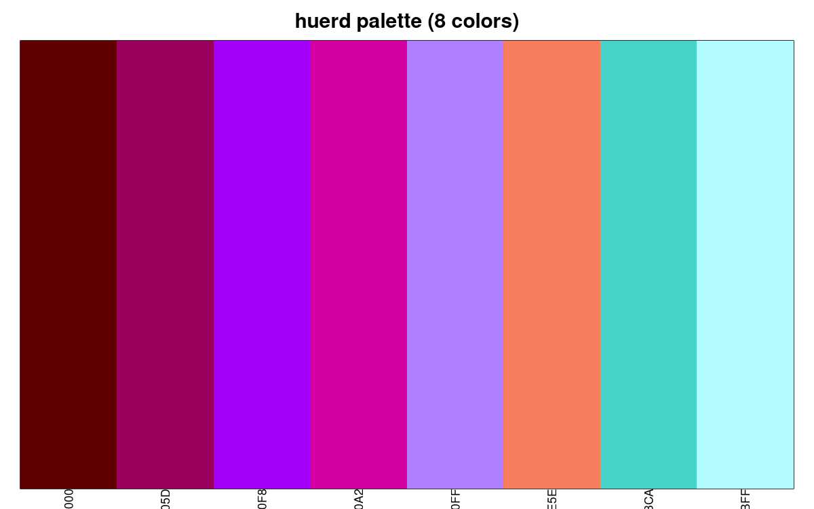
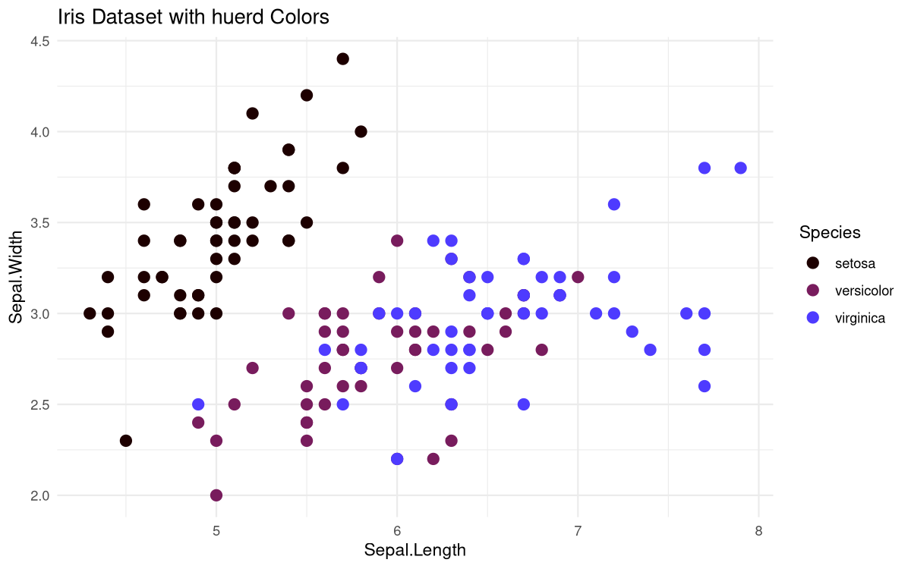
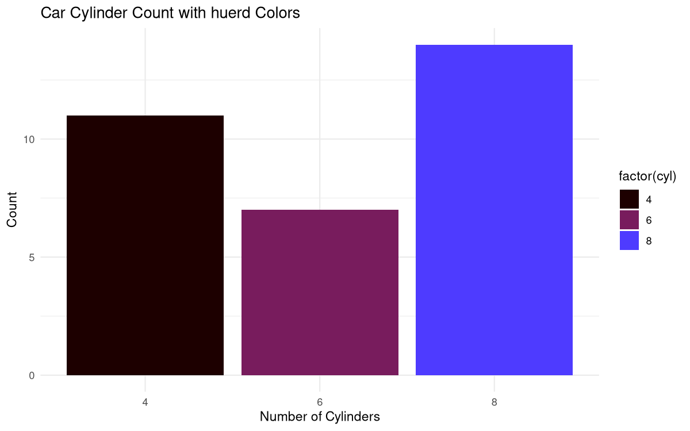
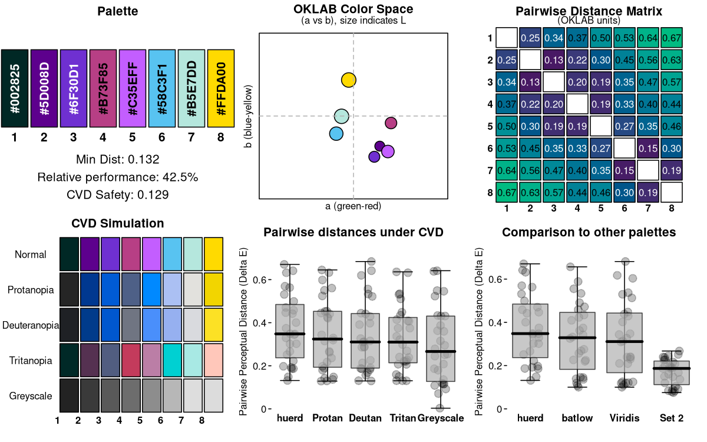
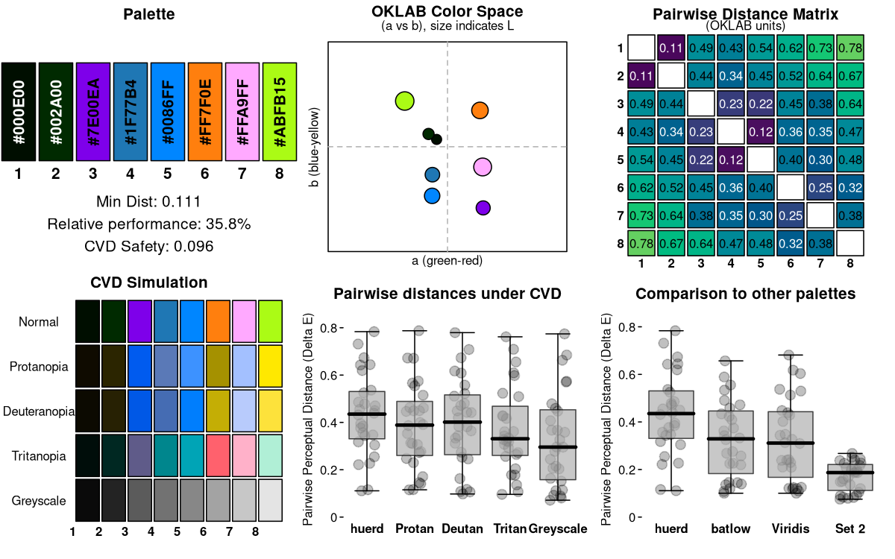

# huerd

A discrete color palette generator with support for fixed colors,
optimized for color vision deficient viewers. Features different
optimization algorithms and a multi-objective optimization framework for
advanced color palette generation.

## Installation

You can install the development version of huerd from GitHub with:

``` r

# install.packages("pak")
pak::pak("sims1253/huerd")
```

## Basic Usage

Generate a palette with 8 colors using either the standard or quick
method:

``` r

library(huerd)

set.seed(42)
# Standard generation with full control
palette <- generate_palette(8, progress = FALSE)
print(palette)
#> 
#> -- huerd Color Palette (8 colors) --
#> Colors:
#> [ 1] #600000
#> [ 2] #99005D
#> [ 3] #A200F8
#> [ 4] #D400A2
#> [ 5] #AE80FF
#> [ 6] #F67E5E
#> [ 7] #45D3CA
#> [ 8] #B2FBFF
#> 
#> -- Quality Metrics Summary --
#> * Min. Perceptual Distance (OKLAB): 0.156
#> * Optimizer Performance Ratio      : 50.3%
#> * Min. CVD-Safe Distance (OKLAB)  : 0.136
#> 
#> -- Generation Details --
#> * Optimizer Iterations: 932
#> * Optimizer Status: NLOPT_XTOL_REACHED: Optimization stopped because xtol_rel or xtol_abs (above) was reached.

# Quick generation for immediate use
quick_palette <- quick_palette(8)
print(quick_palette)
#> 
#> -- huerd Color Palette (8 colors) --
#> Colors:
#> [ 1] #3B0D2D
#> [ 2] #722404
#> [ 3] #A44C00
#> [ 4] #E600FF
#> [ 5] #5BAE00
#> [ 6] #C092BC
#> [ 7] #D2D900
#> [ 8] #73F4C7
#> 
#> -- Quality Metrics Summary --
#> * Min. Perceptual Distance (OKLAB): 0.146
#> * Optimizer Performance Ratio      : 47.1%
#> * Min. CVD-Safe Distance (OKLAB)  : 0.143
#> 
#> -- Generation Details --
#> * Optimizer Iterations: 539
#> * Optimizer Status: NLOPT_XTOL_REACHED: Optimization stopped because xtol_rel or xtol_abs (above) was reached.
```

Visualize your palette:

``` r

library(huerd)

set.seed(42)
palette <- generate_palette(8, progress = FALSE)
plot(palette, type = "swatches")
```



## ggplot2 Integration

Use huerd palettes directly in your ggplot2 visualizations:

``` r

library(ggplot2)
library(huerd)

# Create a huerd palette
set.seed(42)
huerd_colors <- generate_palette(5, progress = FALSE)

# Example with iris data using scale_color_huerd()
ggplot(iris, aes(x = Sepal.Length, y = Sepal.Width, color = Species)) +
  geom_point(size = 3) +
  scale_color_huerd(palette = huerd_colors) +
  theme_minimal() +
  labs(title = "Iris Dataset with huerd Colors")
```



``` r


# Example with mtcars data using scale_fill_huerd()
ggplot(mtcars, aes(x = factor(cyl), fill = factor(cyl))) +
  geom_bar() +
  scale_fill_huerd(palette = huerd_colors) +
  theme_minimal() +
  labs(title = "Car Cylinder Count with huerd Colors",
       x = "Number of Cylinders", y = "Count")
```



## Convenience Functions

Access pre-made palettes and export options for different workflows:

``` r

library(huerd)

# Get a quick palette without generation
quick_colors <- quick_palette(6)
print(quick_colors)
#> 
#> -- huerd Color Palette (6 colors) --
#> Colors:
#> [ 1] #785F0F
#> [ 2] #00AD00
#> [ 3] #FF779D
#> [ 4] #FFA0FF
#> [ 5] #B4DA5B
#> [ 6] #DCFEFF
#> 
#> -- Quality Metrics Summary --
#> * Min. Perceptual Distance (OKLAB): 0.142
#> * Optimizer Performance Ratio      : 38.9%
#> * Min. CVD-Safe Distance (OKLAB)  : 0.135
#> 
#> -- Generation Details --
#> * Optimizer Iterations: 512
#> * Optimizer Status: NLOPT_XTOL_REACHED: Optimization stopped because xtol_rel or xtol_abs (above) was reached.

# Access the default brand palette
brand_colors <- brand_palette(c("#003366", "#FF6600"), n_total = 6)
print(brand_colors)
#> 
#> -- huerd Color Palette (6 colors) --
#> Colors:
#> [ 1] #003366
#> [ 2] #774B1F
#> [ 3] #0058CF
#> [ 4] #FF6600
#> [ 5] #00BCDC
#> [ 6] #E0EB63
#> 
#> -- Quality Metrics Summary --
#> * Min. Perceptual Distance (OKLAB): 0.197
#> * Optimizer Performance Ratio      : 53.8%
#> * Min. CVD-Safe Distance (OKLAB)  : 0.183
#> 
#> -- Generation Details --
#> * Optimizer Iterations: 365
#> * Optimizer Status: NLOPT_XTOL_REACHED: Optimization stopped because xtol_rel or xtol_abs (above) was reached.

# Export palette in different formats for web development
color_names <- paste0("color_", seq_along(quick_colors))
css_output <- export_palette(quick_colors, format = "css", names = color_names)
cat("CSS Output:\n", css_output, "\n\n")
#> CSS Output:
#>  :root {
#>   --color_1: #785F0F;
#>   --color_2: #00AD00;
#>   --color_3: #FF779D;
#>   --color_4: #FFA0FF;
#>   --color_5: #B4DA5B;
#>   --color_6: #DCFEFF;
#> }

sass_output <- export_palette(quick_colors, format = "sass", names = color_names)
cat("Sass Output:\n", sass_output, "\n\n")
#> Sass Output:
#>  $color_1: #785F0F;
#> $color_2: #00AD00;
#> $color_3: #FF779D;
#> $color_4: #FFA0FF;
#> $color_5: #B4DA5B;
#> $color_6: #DCFEFF;

json_output <- export_palette(quick_colors, format = "json", names = color_names)
cat("JSON Output:\n", json_output, "\n")
#> JSON Output:
#>  {
#>     "color_1": "#785F0F",
#>     "color_2": "#00AD00",
#>     "color_3": "#FF779D",
#>     "color_4": "#FFA0FF",
#>     "color_5": "#B4DA5B",
#>     "color_6": "#DCFEFF"
#> }

# Interpret palette quality metrics
quality_info <- interpret_palette_quality(quick_colors)
print(quality_info)
#> 
#> ── Palette Quality Assessment ──
#> 
#> This 6-color palette is moderately optimized (39% of theoretical maximum). Good
#> - colors are reasonably distinct for most uses
#> 
#> ── Distinctness
#> Good - colors are reasonably distinct for most uses
#> 
#> ── Accessibility
#> Excellent - palette is safe for most color vision deficiencies
```

## Constrained Color Palettes

Include specific colors while optimizing the remaining colors:

``` r

library(huerd)

set.seed(123)
palette <- generate_palette(
  n = 8,
  include_colors = c("#4A6B8A", "#E5A04C"),
  progress = FALSE
)
print(palette)
#> 
#> -- huerd Color Palette (8 colors) --
#> Colors:
#> [ 1] #001453
#> [ 2] #4A3976
#> [ 3] #9C2B00
#> [ 4] #4A6B8A
#> [ 5] #9699CB
#> [ 6] #E5A04C
#> [ 7] #B7C4F9
#> [ 8] #8FFFDF
#> 
#> -- Quality Metrics Summary --
#> * Min. Perceptual Distance (OKLAB): 0.130
#> * Optimizer Performance Ratio      : 42.0%
#> * Min. CVD-Safe Distance (OKLAB)  : 0.128
#> 
#> -- Generation Details --
#> * Optimizer Iterations: 480
#> * Optimizer Status: NLOPT_XTOL_REACHED: Optimization stopped because xtol_rel or xtol_abs (above) was reached.
```

## Multi-Optimizer Support

Choose from 4 different optimization algorithms based on your needs (a
fifth, `"nlopt_direct"`, is deprecated and slated for removal):

``` r

library(huerd)

set.seed(456)
# COBYLA: Default deterministic optimizer for general use
cobyla_palette <- generate_palette(6, optimizer = "nloptr_cobyla", progress = FALSE)

# SANN: Stochastic simulated annealing for higher quality
sann_palette <- generate_palette(6, optimizer = "sann", progress = FALSE)

# Nelder-Mead: Derivative-free local optimization
# As an alternative deterministic approach
neldermead_palette <- generate_palette(6, optimizer = "nlopt_neldermead", progress = FALSE)

# L-BFGS: Gradient-based optimization for smooth objectives (v0.5.0+)
lbfgs_palette <- generate_palette(6, optimizer = "nlopt_lbfgs",
                                  weights = c(smooth_repulsion = 1), progress = FALSE)

cat("COBYLA:", paste(cobyla_palette, collapse = ", "), "\n")
#> COBYLA: #20162F, #540772, #813148, #B900CF, #008B6E, #B0A991
cat("SANN:", paste(sann_palette, collapse = ", "), "\n")
#> SANN: #1F0300, #710000, #0035B3, #0067E4, #009EFC, #00E7FF
cat("Nelder-Mead:", paste(neldermead_palette, collapse = ", "), "\n")
#> Nelder-Mead: #215195, #9900FF, #4E8EB6, #FF3A3F, #FFB0C8, #A5E900
cat("L-BFGS:", paste(lbfgs_palette, collapse = ", "), "\n")
#> L-BFGS: #000000, #000088, #0085FF, #FF0000, #00FF00, #FFFFFF
```

## Objective Selection

The `weights` parameter selects the optimization objective:
`c(distance = 1)` for discrete minimax optimization (the default
family), or the smooth `c(smooth_repulsion = 1)` /
`c(smooth_logsumexp = 1)` objectives for gradient-based optimization
with `optimizer = "nlopt_lbfgs"`. Exactly one objective runs per call;
unsupported combinations warn and fall back deterministically, and the
objective actually optimized is recorded in the palette’s metadata.

``` r

library(huerd)

set.seed(789)
# Discrete distance optimization (default)
distance_palette <- generate_palette(
  n = 6,
  weights = c(distance = 1),  # Explicitly select the distance objective
  optimizer = "nloptr_cobyla",
  progress = FALSE
)

# Smooth optimization for faster convergence (v0.5.0+)
smooth_palette <- generate_palette(
  n = 8,
  weights = c(smooth_repulsion = 1),  # Smooth repulsion objective
  optimizer = "nlopt_lbfgs",          # L-BFGS for gradient-based optimization
  progress = FALSE
)

# Alternative smooth objective using log-sum-exp
logsumexp_palette <- generate_palette(
  n = 6,
  weights = c(smooth_logsumexp = 1),
  optimizer = "nlopt_lbfgs",
  progress = FALSE
)

# Compare optimization results
cat("Distance-based palette:\n")
#> Distance-based palette:
print(distance_palette)
#> 
#> -- huerd Color Palette (6 colors) --
#> Colors:
#> [ 1] #11060C
#> [ 2] #4D0E4B
#> [ 3] #9D008E
#> [ 4] #A520FF
#> [ 5] #B589FF
#> [ 6] #FFB8FF
#> 
#> -- Quality Metrics Summary --
#> * Min. Perceptual Distance (OKLAB): 0.171
#> * Optimizer Performance Ratio      : 46.9%
#> * Min. CVD-Safe Distance (OKLAB)  : 0.150
#> 
#> -- Generation Details --
#> * Optimizer Iterations: 518
#> * Optimizer Status: NLOPT_XTOL_REACHED: Optimization stopped because xtol_rel or xtol_abs (above) was reached.
cat("\nSmooth repulsion palette:\n")
#> 
#> Smooth repulsion palette:
print(smooth_palette)
#> 
#> -- huerd Color Palette (8 colors) --
#> Colors:
#> [ 1] #000000
#> [ 2] #003A00
#> [ 3] #0000FF
#> [ 4] #A50000
#> [ 5] #FF00FF
#> [ 6] #FF8D00
#> [ 7] #00FF00
#> [ 8] #FFFFFF
#> 
#> -- Quality Metrics Summary --
#> * Min. Perceptual Distance (OKLAB): 0.288
#> * Optimizer Performance Ratio      : 93.1%
#> * Min. CVD-Safe Distance (OKLAB)  : 0.031
#> 
#> -- Generation Details --
#> * Optimizer Iterations: 45
#> * Optimizer Status: NLOPT_SUCCESS: Generic success return value.
cat("\nLog-sum-exp palette:\n")
#> 
#> Log-sum-exp palette:
print(logsumexp_palette)
#> 
#> -- huerd Color Palette (6 colors) --
#> Colors:
#> [ 1] #000000
#> [ 2] #8C0000
#> [ 3] #0000FF
#> [ 4] #FF00FF
#> [ 5] #00D6FF
#> [ 6] #FFFF00
#> 
#> -- Quality Metrics Summary --
#> * Min. Perceptual Distance (OKLAB): 0.333
#> * Optimizer Performance Ratio      : 91.0%
#> * Min. CVD-Safe Distance (OKLAB)  : 0.088
#> 
#> -- Generation Details --
#> * Optimizer Iterations: 39
#> * Optimizer Status: NLOPT_SUCCESS: Generic success return value.
```

## Diagnostic Dashboard

Get a quick overview of your palette properties:

``` r

library(huerd)

set.seed(2024)
palette <- generate_palette(8, progress = FALSE)
plot_palette_analysis(palette, force_font_scale = 0.6)
```



## Palette Quality Evaluation

Or look at the numerical evaluation results:

``` r

library(huerd)

set.seed(314)
palette <- generate_palette(8, progress = FALSE)
evaluation <- evaluate_palette(palette)

# Access raw metrics (no subjective scoring)
cat("Minimum distance:", evaluation$distances$min, "\n")
#> Minimum distance: 0.1423642
cat("Performance ratio:", evaluation$distances$performance_ratio * 100, "%\n")
#> Performance ratio: 45.9442 %
cat("CVD worst case:", evaluation$cvd_safety$worst_case_min_distance, "\n")
#> CVD worst case: 0.1312194
```

## Custom Parameters

Fine-tune the generation process with advanced options:

``` r

library(huerd)

set.seed(271)
palette <- generate_palette(
  n = 8,
  initialization = "harmony",              # Color harmony-based initialization
  init_lightness_bounds = c(0.3, 0.8),    # Constrain lightness range
  max_iterations = 2000,                   # Increased iterations
  optimizer = "nloptr_cobyla",             # Use COBYLA for optimization
  progress = FALSE
)
print(palette)
#> 
#> -- huerd Color Palette (8 colors) --
#> Colors:
#> [ 1] #B1554F
#> [ 2] #B67A4D
#> [ 3] #8EA700
#> [ 4] #CCB900
#> [ 5] #FF89CC
#> [ 6] #00E6A4
#> [ 7] #C6C0FF
#> [ 8] #00F9EB
#> 
#> -- Quality Metrics Summary --
#> * Min. Perceptual Distance (OKLAB): 0.095
#> * Optimizer Performance Ratio      : 30.5%
#> * Min. CVD-Safe Distance (OKLAB)  : 0.072
#> 
#> -- Generation Details --
#> * Optimizer Iterations: 864
#> * Optimizer Status: NLOPT_XTOL_REACHED: Optimization stopped because xtol_rel or xtol_abs (above) was reached.
```

## Complete Workflow Example

``` r

library(huerd)

set.seed(161)
# 1. Generate brand palette with advanced optimization
my_brand_palette <- generate_palette(
  n = 8,
  include_colors = c("#1f77b4", "#ff7f0e"),  # Fixed brand colors
  fixed_aesthetic_influence = 0.9,
  initialization = "harmony",
  optimizer = "sann",
  max_iterations = 5000,
  weights = c(distance = 1),
  return_metrics = TRUE,
  progress = TRUE
)
#> ℹ Preparing for palette generation...
#> ℹ Adapting initialization from fixed colors' aesthetics...
#> Initializing 6 free colors (method: harmony)...
#> Optimizing 6 free colors using sann...
#> ℹ Finalizing palette...
#> 
#> ✔ Done

# 2. Diagnostic analysis
plot_palette_analysis(my_brand_palette, force_font_scale = 0.6)
```



``` r


# 3. Quality evaluation
evaluation <- evaluate_palette(my_brand_palette)
cat("Min distance:", round(evaluation$distances$min, 3), "\n")
#> Min distance: 0.111
cat("Performance:", round(evaluation$distances$performance_ratio * 100, 1), "%\n")
#> Performance: 35.8 %

# 4. CVD accessibility check
cvd_safe <- is_cvd_safe(my_brand_palette)
if (cvd_safe) {
  cat("Palette is CVD-accessible\n")
} else {
  cat("Palette may challenge CVD viewers\n")
}
#> Palette is CVD-accessible

# 5. CVD simulation for verification
cvd_simulation <- simulate_palette_cvd(my_brand_palette, cvd_type = "all")
print(cvd_simulation)
#> 
#> -- huerd CVD Simulation Result (Multiple Types, Severity: 1.00) --
#> Palette for: original
#>   [ 1] #000E00
#>   [ 2] #002A00
#>   [ 3] #7E00EA
#>   [ 4] #1F77B4
#>   [ 5] #0086FF
#>   [ 6] #FF7F0E
#>   [ 7] #FFA9FF
#>   [ 8] #ABFB15
#> Palette for: protan
#>   [ 1] #0F0B00
#>   [ 2] #2B2500
#>   [ 3] #005BEF
#>   [ 4] #5A79B7
#>   [ 5] #3D92FF
#>   [ 6] #A59100
#>   [ 7] #A3C0FF
#>   [ 8] #FFE800
#> Palette for: deutan
#>   [ 1] #0C0A01
#>   [ 2] #272103
#>   [ 3] #0058E6
#>   [ 4] #456CB3
#>   [ 5] #007EFD
#>   [ 6] #C4AE05
#>   [ 7] #B8CBFC
#>   [ 8] #FDE23B
#> Palette for: tritan
#>   [ 1] #000D0A
#>   [ 2] #002822
#>   [ 3] #5F5B89
#>   [ 4] #00868D
#>   [ 5] #00A4B6
#>   [ 6] #FF616D
#>   [ 7] #FFB1C9
#>   [ 8] #B0EFD6

# 6. Display final palette (colors are brightness-sorted)
print(my_brand_palette)
#> 
#> -- huerd Color Palette (8 colors) --
#> Colors:
#> [ 1] #000E00
#> [ 2] #002A00
#> [ 3] #7E00EA
#> [ 4] #1F77B4
#> [ 5] #0086FF
#> [ 6] #FF7F0E
#> [ 7] #FFA9FF
#> [ 8] #ABFB15
#> 
#> -- Quality Metrics Summary --
#> * Min. Perceptual Distance (OKLAB): 0.111
#> * Optimizer Performance Ratio      : 35.8%
#> * Min. CVD-Safe Distance (OKLAB)  : 0.096
#> 
#> -- Generation Details --
#> * Optimizer Iterations: 5000
#> * Optimizer Status: Optimization converged
```

## Workflow Guides

The huerd package includes comprehensive vignettes for different user
needs:

- **[Data Scientist
  Workflow](https://sims1253.github.io/huerd/articles/data-scientist-workflow.html)**:
  Create accessible dashboard visualizations with optimized color
  schemes for color vision deficient viewers.

- **[Designer
  Workflow](https://sims1253.github.io/huerd/articles/designer-workflow.html)**:
  Integrate brand colors into cohesive palettes and export them in
  various formats (CSS, Sass, JSON) for web development.

- **[Package Developer
  Workflow](https://sims1253.github.io/huerd/articles/package-developer-workflow.html)**:
  Use the programmatic API for reproducible palette generation and
  integrate huerd into your own packages or applications.
